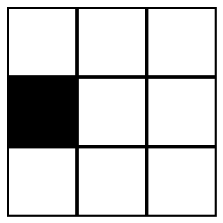
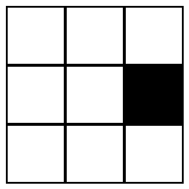

# 001 — Neuromorphic sensors

- **Status:** draft
- **Date:** 2026-08-19
- **Supersedes / Superseded by:** —

## Definition
The term *neuromorphic* sensors in this contexts refers to sensors that senses some value from the environment and fires *spikes* (events) to be send to upper level of the Spike Neural Network.

There are two types of sensors:

### Change based 
Refers to sensor 'retina style': instead of taking images, it fires an spike any time a change is sensed.

This sensors are usually packed in a matrix. 

### Threshold based
It continuous fires while some value of the environment it's inside some range.

Ex: suppose the state of a muscle can be from (0 - no contraction, to 100 - full contracted), one sensor can be one that fires when the value is between 11 and 20.

This sensors are usually packed in an array. Ex: to sense the tension of a muscle 10 sensors are packed so only one is firing at a given time (signalling the level of contraction).

## Goal

Define what counts as a neuromorphic sensor in SNNBot, the event format its
output must use, and the parameters that describe any such sensor — so that
sensors, the network and the simulator can be developed against one interface.

## Scope

**In scope**

- The defining properties a sensor must have to be called neuromorphic here.
- The event (spike) representation shared by all sensors.
- A worked example of both, on the eye of Vehicle 1.

**Out of scope**

- The concrete eye of Vehicle 1 — its array shape, addressing and how it wires
  into the brain (its own spec, when it is written).
- The neuron model and network topology of the brain (separate spec).
- Effectors (separate spec).
- Physical hardware. Everything here is defined so it can be simulated first and
  implemented in hardware later without changing the interface.

## In short

A neuromorphic sensor is a sensor 'retina style': instead of taking images, it
fires events (spikes) any time a change is sensed.

The rest of this spec makes that precise.

## Example

Suppose an artificial eye with 3x3 cells, where each cell can be empty (white) or busy (black):



Each cell has two sensors, one that fires when the cell became busy, and the other one when becames empty.

So if the eye change from last status to this new one:



two events will be fired:

- `2,1 off` (cell 2,1 changed from busy to empty)
- `2,3 on` (cell 2,3 changed from empty to busy)

Note order is important.

What the eye transmits is *not* those two pictures: it is only the two events at the transition between them, and nothing at all from the seven cells that never change. That difference is the whole point of this spec. And because every event carries its own time, their order is itself information — the same two events in the opposite order mean an object moving the other way.

## Definition

A sensor is **neuromorphic** in SNNBot if it has all of the following properties.

1. **Event-driven.** The sensor produces output only when the quantity it
   measures changes. Silence is a valid and meaningful output: nothing changing
   means nothing transmitted.
2. **Asynchronous.** There is no frame rate, no global clock and no sampling
   loop. Each sensing element emits on its own, at the moment its condition is
   met.
3. **Spike output.** The only thing that leaves the sensor is a spike: an
   identical, dimensionless, instantaneous event. All information is carried by
   *which* element fired and *when* — never by an amplitude attached to the
   event.
4. **Local and independent elements.** Each sensing element decides on its own
   state alone. No element needs a value from another element, and no stage
   collects all elements before output can be produced.
5. **Change / contrast coded, not level coded.** The element responds to the
   temporal change of its input, relative to its own recent state, not to the
   absolute value. A constant stimulus, however strong, eventually goes silent.
6. **Sparse.** Under a static scene the output rate tends to zero; bandwidth is
   spent in proportion to how much is happening.

A device that samples all its elements on a fixed clock and emits a full array
of values is **not** a neuromorphic sensor under this spec, even if the values
are later converted to spike trains downstream. The conversion has to happen at
the element, before transmission.

## Event format

Every sensor emits a stream of events:

```
event := (t, address, p)
```

| Field     | Type            | Meaning                                              |
|-----------|-----------------|------------------------------------------------------|
| `t`       | time            | When the event occurred, in simulator time units      |
| `address` | sensor-specific | Which element fired (for the retina: row, column)     |
| `p`       | `ON` \| `OFF`   | Sign of the change that caused it                     |

`ON` means the quantity the sensor measures increased past threshold, `OFF`
means it decreased past threshold. Which quantity that is belongs to each sensor
and must be stated in the spec of that sensor. For the eye of the example above
it is cell occupancy, so a cell going from empty to busy fires `ON` and one going
from busy to empty fires `OFF`. There is no magnitude field: an event is an
event.
This is the usual address-event representation (AER), and the reason for it is
property 3 above — it is what makes the sensor output directly injectable into
the spiking network without any decoding stage.

## Element model

Each element keeps a reference value `L_ref` of its input signal `L(t)`, and
fires when the signal has moved far enough from that reference:

- `L(t) = log(I(t))`, where `I` is the raw quantity that element measures. Taking
  the log makes the threshold mean a *relative* change, so the element behaves the
  same across a wide range of input magnitudes.
- If `L(t) − L_ref > θ` → emit `ON`, then set `L_ref = L(t)`.
- If `L_ref − L(t) > θ` → emit `OFF`, then set `L_ref = L(t)`.
- After emitting, the element is blind for a refractory period `t_ref`.

## Parameters

Any sensor built to this spec is described by:

| Parameter | Symbol  | Meaning                                                |
|-----------|---------|--------------------------------------------------------|
| Contrast threshold | `θ` | Relative change needed to emit an event            |
| Refractory period  | `t_ref` | Minimum time between two events from one element |
| Array shape        | —   | Number and arrangement of elements                     |
| Latency            | —   | Delay between the physical change and the event        |

## Acceptance criteria

- [ ] A sensor implementation emits nothing at all while its input is constant.
- [ ] Output is a time-ordered stream of `(t, address, p)` events and nothing else.
- [ ] No element reads another element's state; no stage waits for all elements.
- [ ] Doubling the input intensity everywhere, with the same relative changes,
      produces the same event stream.
- [ ] Two events from the same element are never closer together than `t_ref`.
- [ ] Every element is individually addressable and has both an `ON` and an
      `OFF` channel.
- [ ] The worked example reproduces exactly: going from the `(2,1)` stimulus to
      the `(2,3)` one yields `(2,1) OFF` then `(2,3) ON`, and nothing else.

## Open questions

- Values for `θ` and `t_ref` — to be fixed once the simulator's time base exists.
- The simulator will likely render stimuli as frames internally. What frame rate
  is fine before the discretisation shows up as artefacts in the event stream?
- Which sensors beyond vision does the bot need (proximity, contact/whiskers,
  motor feedback)? Each would be a separate spec built on this definition.
