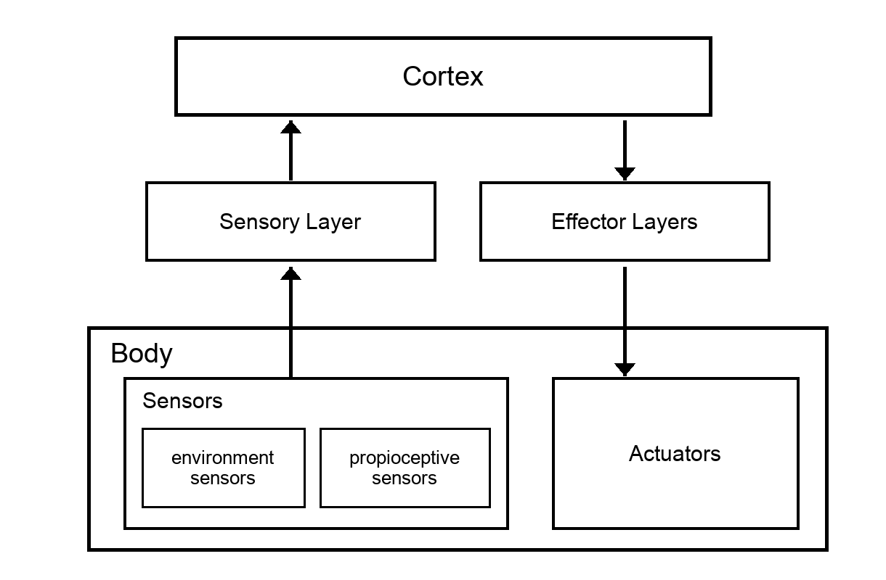

# 002 — Vehicles

- **Status:** draft
- **Date:** 2026-08-20
- **Supersedes / Superseded by:** —

Following the Braintenberg tradition, we will define a series of Vehicles, from the simplest one to more sophisticated.

Every vehicle is built out of the sensor types defined in [spec 001](001-neuromorphic-sensors.md).

## General Architecture
All vehicles have a similar setup for sensor, brain, and actuators.

At the bottom is the *body*: the sensors that face the environment, the propioceptive sensors that face the body itself, and the actuators. On top of it sits the *cortex*, and between them two layers that do the translating — the sensory layer, which takes the spikes the sensors fire, and the effector layers, whose effectors drive the actuators.

Nothing crosses those levels other than spikes, so what changes from one vehicle to the next is what hangs off the bottom level and how the cortex is wired, not the shape of the stack.

## Vehicle 1

This vehicle has:

- sensors
  - one very simple eye: just an array of 9 cells (1x9)
  - two propioceptive sensors (1x10 sensors each) to sense the level of contraction of each actuator
- actuators
  - one attached to the right of eye and the other to the left

So the vehicle can't move, it just can move the eye to both sides.

Its shape is a T: the eye is the head, the joint is where the head meets the stem, and both actuators run from the middle of each half of the head down to the middle of the base. The black cell is an object standing in front of the eye, seen here by cell 3:

Contracting one actuator stretches the other and the head turns around the joint, so the eye ends up looking to that side:

The object has not moved — the head has. If each cell covers 9 degrees of the world (a number still to be fixed), turning 18 degrees to the left slides the object two cells along the eye, from cell 3 to cell 5: the eye has centred what it was looking at off to one side.

Which is worth keeping in mind when reading [spec 001](001-neuromorphic-sensors.md): between those two pictures the eye fires `3 off` and `5 on`, and yet nothing in the world moved. To the retina, moving the eye and the world moving look exactly the same.
