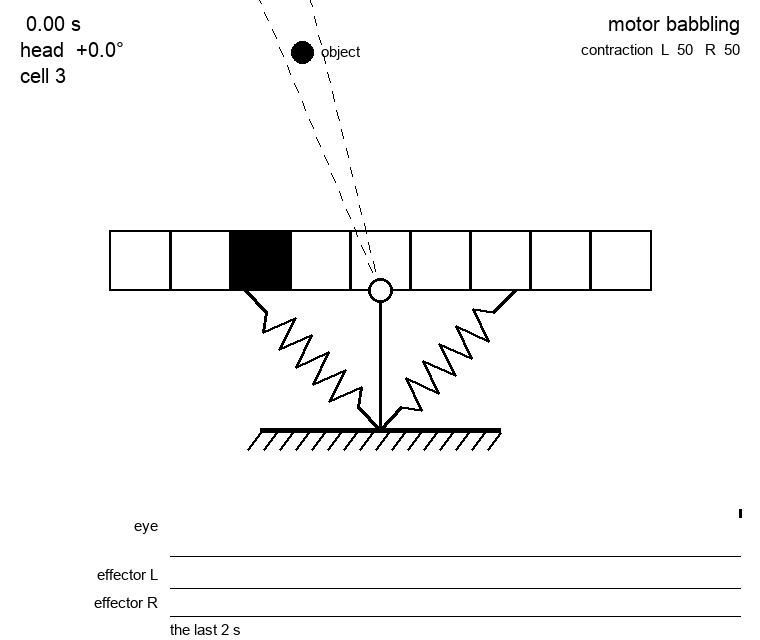
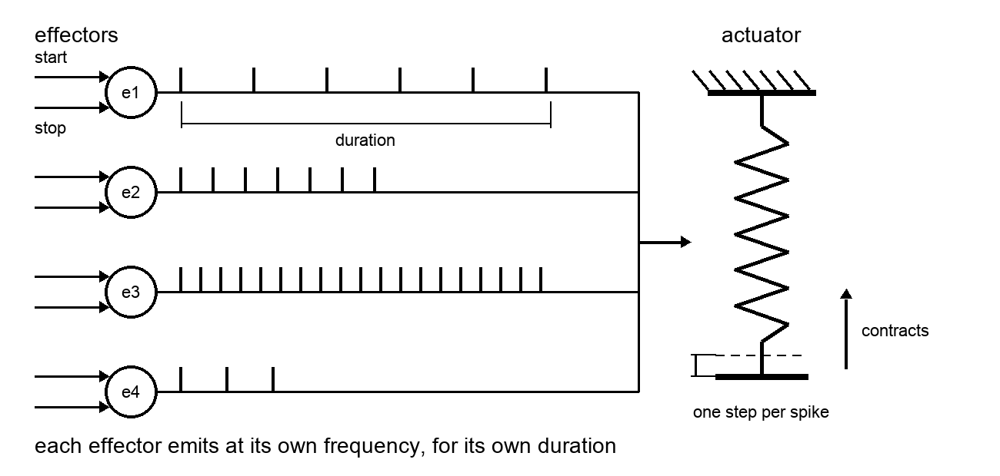

# 003 — Neuromorphic actuators

- **Status:** draft
- **Date:** 2026-08-20
- **Supersedes / Superseded by:** —

## Definition
The term *neuromorphic* actuator in this context refers to an actuator driven by spikes and by nothing else: it takes no position to go to and no speed to go at, it just receives spikes and moves a little on each one.

An actuator moves in **one direction only**: it contracts (or, the other way round, it extends), and it cannot undo that movement by itself. Bringing it back is somebody else's job — in [Vehicle 1](005-vehicle-1.md) it is the antagonist actuator, which pulls the head the other way and stretches this one.

If an actuator is not receiving any spikes it goes to relax mode in a short period of time.

## Effectors
An *effectors* is an special kind of neuron responsible for moving actuators. Every spike an effector fires contracts the actuator by one fixed step. An actuator can be attached to many effectors.

An effector has two inputs, and a single spike on either one is enough: one tells it to **start** emitting, the other tells it to **stop**. Once the start is received the effector emits spikes at its own frequency for also its own duration (or when a stop spike is received).

So it's common to have many effectors attached to the same actuator (with different frequencies and duration) in order to fine tune the actuator movements.

An effector whose two inputs are not wired yet is *uncontrolled*: it fires on its own, which is what makes a vehicle babble before its cortex has taken hold of it — see [spec 002](002-vehicles.md). Once it is wired it never does so again, and everything below is about a wired one.

This is what that looks like, run in the simulator of [spec 004](004-simulator.md) with every effector of [Vehicle 1](005-vehicle-1.md) still unwired:



The bursts in the two lower rows are the uncontrolled effectors going off at random, each emitting at its own frequency for its own duration. Every spike in a burst contracts its actuator one step and stretches the antagonist, which is why the head swings while they fire and holds still between them. The object never moves, and the eye fires all the same.

So the brain never has to sustain a movement. One spike is usually the whole command: the effector runs its own course and stops by itself, and the `stop` input is there for cutting it short before that:

```
total contraction = step × frequency of the effector × how long it emits
```

where *how long it emits* is the effector's own duration, or the time up to the `stop` spike if one arrives first. Between the two, the brain picks how far the actuator travels by picking which effector to start.

Each effector fires at its own frequency, so which effector is firing is what sets how fast the actuator moves: a slow effector contracts it slowly, a fast one contracts it quickly. The actuator itself has no notion of speed — the speed is just how often the spikes arrive.

```
contraction speed = step × spikes per second arriving from the effectors
```



This is the mirror image of the threshold based sensors of [spec 001](001-neuromorphic-sensors.md): there, which sensor is firing tells the brain the level of contraction; here, which effector is firing tells the actuator how fast to contract.

## Actuator Parameters

| Parameter | Meaning                                                        |
|-----------|----------------------------------------------------------------|
| Step      | How much the actuator contracts on a single spike               |
| Range     | The span of contraction, from fully relaxed to fully contracted |
| Effectors | How many are attached to the actuator                           |
| Relax time | How long it takes to relax once no spikes are arriving         |

## Effector Parameters

| Parameter | Meaning                                                        |
|-----------|----------------------------------------------------------------|
| Frequency | How often it emits, once started                                |
| Duration  | How long it goes on emitting if nothing stops it                |

## Acceptance criteria

- [ ] The actuator has no input other than spikes.
- [ ] One spike moves it exactly one step, always in the same direction.
- [ ] The same effector firing for twice as long contracts it twice as much.
- [ ] A faster effector contracts it faster, with no other change.
- [ ] Nothing the actuator can do by itself moves it back.
- [ ] Once wired, an effector emits nothing until a `start` spike arrives.
- [ ] Once started it emits at its frequency for its duration, with nothing else
      arriving, and then stops on its own.
- [ ] A `stop` spike ends the emission earlier, and nothing is emitted after it.

## Open questions

- If several effectors fire at once, do their rates add up, or is only one meant to be active at a time, the way only one threshold sensor is?
- What happens at the end of the range, when it is already fully contracted — are the spikes simply ignored?
- Is the step the same size at every level of contraction?
- How many effectors does each actuator of Vehicle 1 have, and with what frequencies and durations?
- What does an effector do with a second `start` while it is already emitting, or with a `stop` while it is not?
