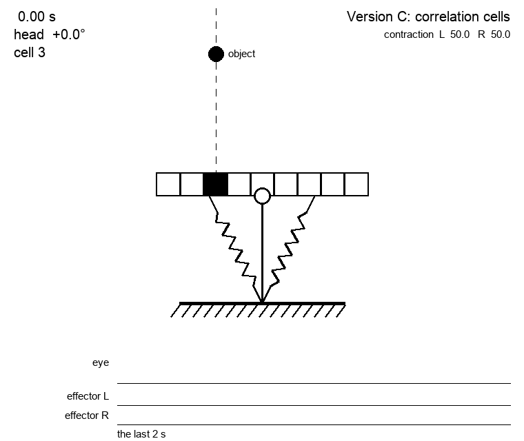
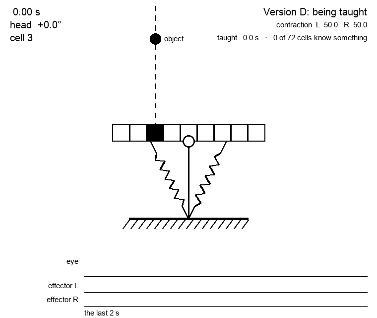
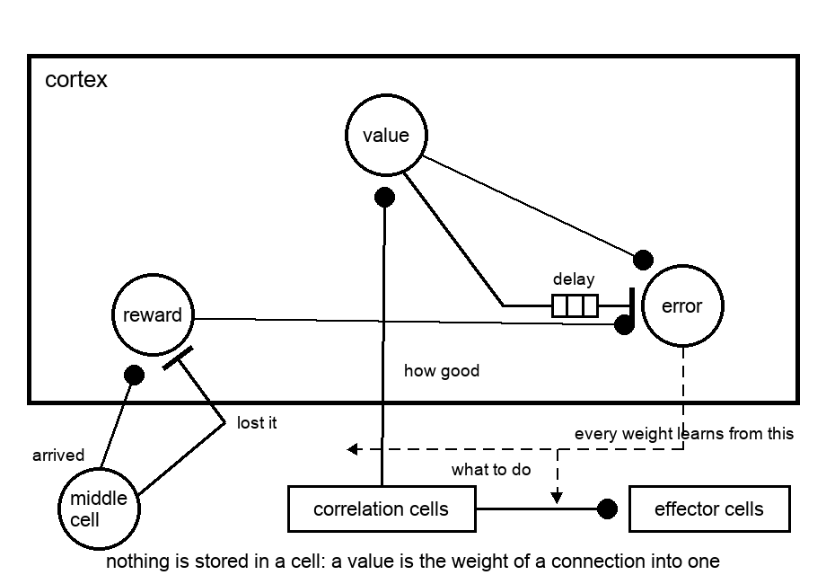
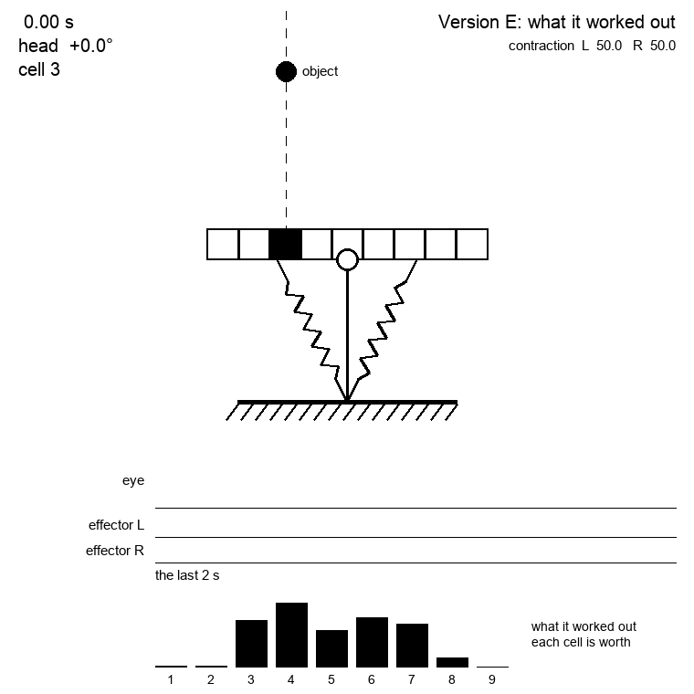
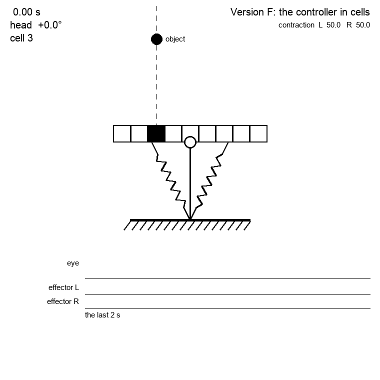

# 005 — Vehicle 1 - a moving eye

- **Status:** draft
- **Date:** 2026-08-25
- **Supersedes / Superseded by:** —

The first of the series of [spec 002](002-vehicles.md), and the simplest one. 

This vehicle has:

- sensors
  - one very simple eye: just an array of 9 cells (1x9) that can have some kind of lateral inhibition (not modeled) that only allow to perceived one cell ON maximum. this is to simulate viewing a source of light.
  - two propioceptive sensors (1x10 sensors each) to sense the level of contraction of each actuator
- actuators
  - one attached to the right of eye and the other to the left (agonist and antagonist) that move the eye.

So the vehicle can't move, it just can move the eye to both sides.

Its shape is a T: the eye is the head, the joint is where the head meets the stem, and both actuators run from the middle of each half of the head down to the middle of the base. The black cell is an object standing in front of the eye, seen here by cell 3:


Contracting one actuator stretches the other and the head turns around the joint, so the eye ends up looking to that side:


The object has not moved — the head has. If each cell covers 9 degrees of the world (a number still to be fixed), turning 18 degrees to the left slides the object two cells along the eye, from cell 3 to cell 5: the eye has centred what it was looking at off to one side.

Those angles are measured from the joint, not from each cell: the eye takes whatever it is looking at to be far enough away that where along the head a cell happens to sit makes no difference to the direction it sees the object in. Something close by — a couple of head lengths away — would break that, and would need the parallax worked out cell by cell. This vehicle does not do it.

Which is worth keeping in mind when reading [spec 001](001-neuromorphic-sensors.md): between those two pictures the eye fires `3 off` and `5 on`, and yet nothing in the world moved. To the retina, moving the eye and the world moving look exactly the same.

## Version A: PID controlled

This version acts as a 'ground truth' testing vehicle, instead of being controlled by neurons, its just controlled by a plain PID controller.

It runs the **same body** as the spiking version: the same T, the same joint, the same head range of ±40 degrees, the same two antagonist actuators. A ground truth that changed the body as well would leave any difference in behaviour unattributable to the brain, which is the one thing it exists to measure. What changes is the controller, and that the controller reads numbers where the other reads spikes.

Its sensors are analog:

- **Eye**: a number from 1 to 9, which cell is active — nothing at all when no cell is.
- **Eye angle**: a number from −40 to +40 degrees, positive when the eye is turned to the left, the same sense as everywhere else in this spec.

Its actuator is the same pair, so what the controller puts out is not a force but a **rate of turn**: degrees per second, positive turning the eye to the left. It is capped at the 80 degrees per second the spiking vehicle manages at its fastest — its quickest effector, at 100 Hz, into a step of 0.8 degrees, which is well short of the 500 Hz the refractory period would allow. A reference that can outrun the vehicle it is a reference for is not much of a reference.

The task is to bring whatever the eye sees to the middle of the eye, so the error is how far the active cell is from cell 5, in degrees:

```
error = (5 − active cell) × the degrees one cell covers
```

which is positive when the object sits left of centre and the eye has to turn left — positive — to catch it. Counting the error in degrees rather than in cells is what keeps `Kp` meaningful: the width of a cell is still a provisional number, and an error in cells would carry that number into the gain, so changing the width later would silently change how the vehicle behaves.

**When no cell is active the vehicle does nothing.** There is no error to speak of, and it stays where it is until something turns up in front of it.

### It is really a P controller
A PID has three terms and on this body two of them are zero, so it is worth saying which and why.

The plant is a pure integrator: what the controller sets is the rate the eye turns, so the angle is the running total of everything it has ever asked for. On such a plant proportional feedback alone converges exponentially and never overshoots — the eye slows as it closes in, and stops when the error does.

- The **integral** term has no steady-state error to remove, because the proportional term leaves none. All it can do is pile up on the way in and carry the eye past the target, and wind up against the ±40 degree stop whenever the object is out of reach.
- The **derivative** term would be differentiating a nine-step staircase: zero almost everywhere and an impulse at every cell crossing. It would add kicks, not damping, and there is nothing here to damp.

So `Ki = Kd = 0`, and what is left is

```
rate of turn = Kp × error
```

in degrees per second, capped at ±80. With the error in degrees, `Kp` is in units of one over seconds: it is a rate constant, and `1 / Kp` is roughly how long the eye takes to close the gap. **`Kp = 2`**, so the eye takes about half a second to catch what it is looking at.

The output is a plain continuous number — unlike the spiking vehicle, which moves the head in steps of 0.8 degrees, this one turns it smoothly.

The controller runs once every tick, the 1 ms of the simulator of [spec 004](004-simulator.md), so that it gets to act exactly as often as the spiking vehicle does and neither is favoured by being asked more often. The interval is a parameter and can be changed — a controller that runs more slowly than the body moves is a different thing to compare against, and a fair one to want.

Changing it is not free, though. The eye slows down as the error shrinks, but only at each tick: between ticks it keeps turning at whatever rate it was last told. So the eye closes `Kp × tick` of the gap on every step, and the pair has a limit — past `Kp × tick = 1` it starts overshooting, and past 2 it never settles. At a millisecond there is room to spare, since breaking it would need a `Kp` above a thousand. At a tick of a second there is none: `Kp = 2` would be enough.

### The experiment
The run both versions are put through, so that whatever is measured is measured on the same thing:

The object waits **three seconds** where it is, slides **to the left for three**, turns and goes **back to the right for six**, and is then still again. The first stretch is there to let the vehicle settle, so that what follows is a response and not a leftover of the start. The next asks it to keep up with something rather than merely find it once. The turn asks the most of it: following a thing is not the same as following it back, and a vehicle that only ever learned one direction fails exactly there.


Two things worth watching in it, both of them consequences of an error that can only take the values a whole number of cells allows.

The eye comes to rest with the object at the **edge** of the middle cell rather than at its centre: the error is zero anywhere inside cell 5, so the eye stops the moment the object crosses in.

And while the object is creeping left the eye **chatters at the cell boundary** — look at how the eye's row of the raster fills up. Inside cell 5 the error is zero and the eye stands still while the object drifts out of it; the moment it crosses into cell 4 the error jumps a whole cell at once, the eye lunges at three times the speed the object is moving, and puts it back where it was. The head ends up trembling against the edge of a cell, and the eye fires about a hundred times a second over an object that is barely moving.

Which is worth knowing before the number that judges a run is settled: this vehicle is at its noisiest exactly where it is doing best. Most of that noise no longer reaches the eye's output, the 20 ms the eye waits before reporting a cell as busy being longer than most of the trembling — but the head still trembles, and the effectors still pay for it. A faster object is easier on it — it simply settles a cell behind and stays there. Curing the chatter would mean hysteresis, or a dead zone around zero error, and neither is decided yet.

### Speed, which it wants only if taught to
The speed cells of [spec 010](010-cells.md) were fed to it, every one of their 280 joining the vote alongside the cell that says which way the object went. It does worse with them. Over twelve seeds, taught four minutes each:

| what the layer offers it | holds the object in the middle |
|--------------------------|--------------------------------|
| direction only | 9.67 s on average, worst run 3.72 |
| direction and speed, all of them voting | 7.77 s, worst run 0.00 |
| direction and speed, the most certain cell deciding | 8.62 s, worst run 2.64 |

Two reasons it was never likely to help. Centring a thing is a question about **where** it is, and the cell that reports a direction already carries that; a speed says nothing further about which way to turn. And the 280 extra cells have to be learnt from the same reward as the rest, so they mostly add states that dilute what the few useful cells have worked out — visible in the middle row, where letting them all vote is worse than letting the most certain one decide.

There is a third reason, and it is the one that turned out to matter. The vehicle was taught against **an object that never moves**, so that every change on its retina was its own doing. Which means the only speeds it ever saw were its own. A cell reporting how fast something crossed the eye was, throughout its schooling, reporting how fast the head swung — never how fast the world went.

So it was taught again against an object that wanders, picking a new heading and a new speed over and over, and the sign changed:

| taught against | what the layer offers | holds the object in the middle |
|----------------|-----------------------|--------------------------------|
| an object that never moves | direction only | 9.67 s |
| an object that never moves | direction and speed | 7.77 s |
| an object that wanders | direction only | 6.88 s |
| an object that wanders | direction and speed | 9.78 s |

Neither half is any use on its own. Cells that read a speed are a liability with nothing to read; a moving object during training is a liability with nothing to read it — it muddies the credit, exactly as feared, and costs the direction-only vehicle nearly three seconds. Together they recover all of it.

Against the plain vehicle they do not win by much. Over twenty seeds the two hold the object for 9.64 s and 10.14 s, which is the same number given the spread. What differs is the spread itself, 2.94 against 2.36, and the worst run of the twenty: 3.72 s against 6.20. The taught-on-movement vehicle is not better on its good days. It has fewer bad ones.

### Open questions

- What counts as success? Time taken to bring the object to cell 5, the fraction of a run spent there, something else. Until that is settled Version A is a vehicle that works, but not yet a measurement anything can be compared against.

## Version B: reflex based
The goal of this version is to evaluate how good can be a controller where the sensory layer and the effector layer are directly connected (without a cortex), so it's reflex based.

Also the connection comes hard wired, no learning is done.

For each cell in the retina there are a cell in the sensory layer that fires when the retina cell fires. This sensory cell is connected with an effector cell, it's is assumed a lateral inhibition mechanisms in the effector layer, so only one effector cell is active (the last activated one).


For this version the Version A retina will be used (it's fires in the busy cell). The spiking eye comes in version C.

### The wiring
Which effector a cell reaches is settled by the task rather than chosen. A cell left of the middle means the object is to the left, so the head has to turn left; and the further out the cell, the further the head has to go, so the further out the cell the faster the effector it wakes. The middle cell reaches nothing — there is nowhere to go from there.

| cell | turns | effector |
|------|-------|----------|
| 1 | left  | the fastest |
| 2 | left  | ↓ |
| 3 | left  | ↓ |
| 4 | left  | the slowest |
| **5** | **nothing** | **none** |
| 6 to 9 | right | the same, mirrored |

Which is four effectors on each actuator, exactly the set spec 003 already gives them, and it is what settles their frequencies: they are the speeds this vehicle picks between.


Watch the two effector rows of the raster: this vehicle moves because something spikes, which is the whole difference from Version A.

## Version C: reflex with neuromorphic retina
This is similar to Version B, but this time the retina is full neuromorphic, so it only respondo to changes.

Remember that in this kind of retina there are two sensor per cell, one that fires when cell moves from empty to busy (ON) and other for busy to empty (OFF). So if the busy cell moves from cell 1 to cell 3, two events will be triggered: the first is the OFF sensor of cell 1 and later the ON sensor of cell 3 (order is important).

Note this version is incapable of centering an object that isn't moving. This restriction will be solved in later versions.

The sensory layer is composed of correlation cells which have two inputs, one (the predecessor input) to an OFF sensor, and a successor to a ON one, so the fire cells when there is a move from one cell to the other. This layer is fully connected, so there are 72 cells (9 sucessor input times 8 possible predessors).

Each of this cells is connected to an effector cell.

### The order the cells read
The two events of a move only come in an order if something makes them. With the cells of the eye covering the world edge to edge and the object a point, it leaves one cell in the very instant it reaches the next, and both events carry the same time — a correlation cell waiting for its predecessor to arrive first would wait forever.

The eye is not the place to fix that. It reports both events when they happen, and a **delay cell** of [spec 010](010-cells.md) on the arrival is what holds one back — 20 ms, which lands in the middle of the window those cells accept rather than on an edge of it.

What the eye does keep is a **settling time**: a cell says a thing has arrived once it has been there five milliseconds, and says nothing at all about one that came and went inside that. Which is not the same as reporting late — it is a sensor that needs a moment to be sure — and it is what keeps the trembling of a head at a cell boundary out of the record while letting through every real crossing, none of which takes less than a tenth of a second.

That is not the whole of it either. Cells that share their edges leave an object standing on one of them inside both at once, so the cell being reached reports before the cell being left and the lag does no more than cancel that head start out. The cells are half open — each takes its own edge and leaves the next one to its neighbour — so an object is never in two of them.

### The wire out of each cell
Every one of the 72 has its own wire to an effector, and several name the same one: they are moves that end in the same place, having started in different ones. Any one of them is enough to wake it.

A cell that ends in the middle is the exception worth naming. Waking nothing there stops the head dead the moment the object arrives, which is precisely what leaves it drifting straight back out again, so those cells go on the way the object was going, gently. Gently needs an effector the ladder of spec 003 does not have: its slowest runs the head some eight degrees, near enough a whole cell, and a nudge that size overshoots every time. Hence a fifth, at 5 Hz — four degrees in its run, about the speed of the thing it is keeping up with.



The six seconds of nothing at the start are what an object that will not move looks like from in here. Which makes the babbling of [spec 002](002-vehicles.md) the only way this vehicle could ever start on its own.

Watch the eye's row of the raster afterwards: it stays nearly empty. Over the fifteen seconds this vehicle spends a quarter of the eye events Version B does and a tenth of Version A's, and it is still the one that ends up closest to the object.


## Version D: the wiring is learnt
The same body, the same eye and the same 72 correlation cells as Version C. What changes is that nobody says beforehand which effector each of those cells reaches. The vehicle has to find that out.

Which needs something to learn from, and the obvious candidate is not available: there is no measure of how far the object sits from the middle. 

### The error is not there, but its sign is
It turns out that is enough, because what a learner needs is not the error but whether the last thing it did made the error smaller.

A correlation cell says the object went from cell i to cell j. Whether it got closer to the middle or further from it is then settled by the pair alone — no measurement, no arithmetic at run time, and nothing read off the world. It is a fixed property of each cell, decided once when the layer is built:

| the cells where | meaning | how many |
|-----------------|---------|----------|
| `abs(j - middle) < abs(i - middle)` | it came closer | 32 |
| `abs(j - middle) > abs(i - middle)` | it went further | 32 |
| `abs(j - middle) == abs(i - middle)` | neither, it crossed over | 8 |

So the reinforcement signal is not a quantity to be computed but **a partition of the sensory layer**: some of its cells mean *better* and some mean *worse*, by virtue of which cells of the eye they are wired to. The eye did not take the error signal away. It handed it over already differentiated, which is the form a learner wants it in.

On top of that sits a rarer and blunter one, free of any wiring at all: the ON of the middle cell is *arrived*, and its OFF is *lost it*. Too rare to learn from on its own — a vehicle that knows nothing reaches the middle almost never — but worth having as a bonus over the graded signal that arrives at every move.

### Which wire gets the credit
The signal turns up after the act, so something has to remember what was done. When a correlation cell wakes an effector, the connection between those two is left **eligible**, and the eligibility fades. When a reinforcing spike arrives it strengthens every connection still eligible, by however much of the eligibility is left. Nothing here is global: a connection is changed by what passed through it and by a signal that reaches it, and by nothing else.

### What the connection becomes
The table of Version C, one effector per cell, becomes a weight per pair of cell and effector. What fires is the strongest, or one drawn from among the strong so that the vehicle keeps trying things it has not settled on.

This is what the layer being fully connected was for. Under a fixed wiring, 56 of the 72 cells can never fire at all, since the object never skips a cell, and a table with 56 dead entries looks like waste. Under a learnt one it is not: which pairs matter is precisely what is not known in advance, and the ones that never occur simply never update.

### Babbling, and what it is now for
Two things stand in the way of learning, and they have the same cure.

The vehicle cannot tell its own movement from the world's. An object that moves while the vehicle is learning credits it for transitions it did not cause. So it is taught against **an object that stays still**, where every change on the retina is its own doing and the credit is clean.

But a still object seen by an eye that reports only change produces nothing at all, as Version C shows for six seconds together. The only way to make a still world visible is to move, which is what the babbling of [spec 002](002-vehicles.md) is.

Which puts babbling at odds with the rule that an effector, once wired, never babbles again — because a vehicle that is still learning has to keep exploring. The way out is that a weight is not a wire: **uncontrolled** stops being a state a cell is in and becomes what a cell does while nothing is telling it convincingly what to do. Babbling then fades of its own accord as the weights grow, and the rule in spec 002 turns from something imposed into something observed at the end of learning.

### What it learns



Being taught, in three windows of the same four minutes: the first seconds, the middle, and the end. The object never moves, so the only thing that can make it visible is the vehicle moving itself, and early on that is all there is — flailing, and the object wherever it happens to land. By the end the flailing has largely gone and the object mostly sits in the middle cell.

The counter is how many of the 72 cells have learnt anything at all, and it is the discouraging part: after four minutes it is around ten. Only 16 of the 72 can ever fire, since the object never skips a cell, so it is ten of a possible sixteen — but the vehicle spends much of its schooling somewhere it has already been.

Afterwards, with learning off and nothing left to chance, it runs the experiment like this:


That is one run of one seed, though, and this vehicle varies a great deal from seed to seed:

| | holds the object in the middle |
|---|---|
| Version C, wired by hand | 7.84 s of 15 |
| Version D, taught four minutes, over eight seeds | 8.70 s on average, from 6.07 to 11.38 |

So it learns — an untaught vehicle manages almost nothing, and a taught one lands in the same range as the wiring put in by hand. But it does not yet beat it. The spread across seeds is wider than the difference between the two, which means a single run of Version D says more about its seed than about learning, and a good one should not be reported as a result.

### Speed, which it wants only if taught to
The speed cells of [spec 010](010-cells.md) were fed to it, every one of their 280 joining the vote alongside the cell that says which way the object went. It does worse with them. Over twelve seeds, taught four minutes each:

| what the layer offers it | holds the object in the middle |
|--------------------------|--------------------------------|
| direction only | 9.67 s on average, worst run 3.72 |
| direction and speed, all of them voting | 7.77 s, worst run 0.00 |
| direction and speed, the most certain cell deciding | 8.62 s, worst run 2.64 |

Two reasons it was never likely to help. Centring a thing is a question about **where** it is, and the cell that reports a direction already carries that; a speed says nothing further about which way to turn. And the 280 extra cells have to be learnt from the same reward as the rest, so they mostly add states that dilute what the few useful cells have worked out — visible in the middle row, where letting them all vote is worse than letting the most certain one decide.

There is a third reason, and it is the one that turned out to matter. The vehicle was taught against **an object that never moves**, so that every change on its retina was its own doing. Which means the only speeds it ever saw were its own. A cell reporting how fast something crossed the eye was, throughout its schooling, reporting how fast the head swung — never how fast the world went.

So it was taught again against an object that wanders, picking a new heading and a new speed over and over, and the sign changed:

| taught against | what the layer offers | holds the object in the middle |
|----------------|-----------------------|--------------------------------|
| an object that never moves | direction only | 9.67 s |
| an object that never moves | direction and speed | 7.77 s |
| an object that wanders | direction only | 6.88 s |
| an object that wanders | direction and speed | 9.78 s |

Neither half is any use on its own. Cells that read a speed are a liability with nothing to read; a moving object during training is a liability with nothing to read it — it muddies the credit, exactly as feared, and costs the direction-only vehicle nearly three seconds. Together they recover all of it.

Against the plain vehicle they do not win by much. Over twenty seeds the two hold the object for 9.64 s and 10.14 s, which is the same number given the spread. What differs is the spread itself, 2.94 against 2.36, and the worst run of the twenty: 3.72 s against 6.20. The taught-on-movement vehicle is not better on its good days. It has fewer bad ones.

### Open questions

- How much does a reinforcing spike change a weight, and how fast does eligibility fade? Between them they set whether the vehicle learns at all and whether what it learns survives one bad run.
- How strong must a weight be before a cell stops babbling, and does it ever go back?
- Standing still in the middle earns nothing. The vehicle is paid for *improving*, and improving means having got worse first, so a vehicle that wanders off and comes back is paid for the coming back. It does not do that here, but nothing in the reward says it must not.
- Ten of the sixteen cells that can fire is poor coverage for four minutes of schooling. Teaching it against an object that is not always in the same place would visit more of them.

## Version E: it works out what is worth doing

Version D is handed the one thing that matters most. `outcome` tells it, for each of the 72 correlation cells, whether that cell means the object came nearer the middle or went further from it — a partition of 32 good, 32 bad and 8 neither, worked out by whoever wrote it down. The vehicle learns which effector to wake, but never what *better* is.

This version is not handed it.

### Something has to be innate
Nothing can learn that one thing is better than another out of nothing at all. There has to be a first preference, and the whole question is how small it can be made.

Small as **one cell of the eye and its own two sensors**. The middle cell going busy means *arrived*; the middle cell going empty means *lost it*. Two spikes, against a table of 72 entries. Nothing else is given, and everything else — including which of the 72 correlation cells are the good ones — has to be worked out from those two.

That is still something innate, but of the kind an animal is born with rather than told. The middle of an eye is special because the whole animal is built around it.

### A value is not something a cell knows
The way to learn from a rare signal is to let it spread backwards: a cell that tends to be followed by *arrived* becomes worth reaching, and then a cell that tends to be followed by **that** one does too. Which needs a value per cell — and the obvious way to keep one, a number held inside the cell, is not allowed here. [Spec 010](010-cells.md) says a cell knows the spikes at its inputs and nothing else, not another cell's state, and working out how a value has changed means reading two of them.

So the value is not kept in the cell. **It is the weight of that cell's connection into another one.** Nothing is stored anywhere except in connections, which is where this project has kept everything all along, and where a brain keeps it too.

That takes three cells, and they are the first occupants of the **cortex** — the box that has sat empty in [spec 002](002-vehicles.md) since the beginning, above the body and unable to touch it, which is exactly what something that judges rather than acts should be:



A circle is one cell and a box a group of them, and the delay is neither — it belongs to the connection it sits on, the way a real one belongs to the axon it travels down.

- The **reward** cell is the innate drive, and it is two wires: excited by the middle cell going busy, inhibited by it going empty. It learns nothing, ever.
- The **value** cell is reached by every correlation cell, each through a weight. Its firing is how good the vehicle's situation is, and that judgement lives entirely in those weights.
- The **error** cell takes the reward, takes the value as it is now, and takes the value as it was a moment ago through a delay and an inhibitory connection — so what it fires is the difference between what just happened and what was expected. That is the signal every weight in the vehicle learns from, the actor's and the critic's alike.

The delay is the same trick the correlation cells use. The subtraction is an inhibitory input. Every rule stays local: a connection changes by its own eligibility and by a signal that arrives at it, and no cell ever reads another.

### How to tell whether it worked
Not by the time it holds the object, which has told the versions apart poorly. By whether it **rediscovers the partition**: sort the correlation cells by the weight each has onto the value cell, compare against the 32 good and 32 bad that `outcome` was written to say, and count how many it puts on the right side.

That is a number this project has not had before — a claim about what the vehicle understood, not about how well it did. And it can be beaten: the written partition calls a move from cell 6 to cell 4 *neither*, the distance to the middle being one either way, when what actually happened is that the object crossed the middle. A vehicle that finds those worth something has found something the spec got wrong.

### What happened
It works, and getting there took correcting two things about the critic rather than anything about the vehicle. Over eight seeds, taught four minutes each:

| | holds the object | agrees with the partition |
|---|---|---|
| Version D, handed the partition | 8.58 s | — |
| **Version E, finding it** | **8.04 s** | **89%**, from 87 to 97 |

The same as the version that is told, within a spread far wider than the difference, and it rediscovers between seven and eight of every eight moves that spec 010 labels — from two wires out of one cell of the eye, having been told nothing about what any move means.

#### It valued the wrong thing
The first attempt agreed with the partition 44% of the time, which is chance, and the cells it learnt most strongly about were arriving at the middle from either side, learnt as firmly bad.

That was not a fault in the learning. A value is what a state leads to, and the critic had been given correlation cells to value — but a correlation cell is not a state, it is a **move**. Asking what a move is worth and then comparing the answer to a partition of moves looks like the same question twice and is not: the partition says which way a move went, a value says what came after it.

Values belong to **places**. Every cell firing at one moment names the same place, having reached it from different ones, and it is that place they are all asking about. Valuing the place instead, the vehicle learns a hump:

```
cell     1     2     3     4     5     6     7     8     9
value  0.04  0.14  0.70  0.93  0.61  1.04  0.66  0.27  0.10
```



The bars along the bottom are that hump, and they are the whole of what this version has that the others do not: a vehicle that has worked out, from two wires, where it wants things to be.

Which is the vehicle saying, unprompted, that the middle of its eye is where it wants things to be. And the partition falls out of it as a difference — `V(where it went) − V(where it came from)` — which is what a partition of moves was all along.

#### And it could not be paid for staying
Before that, every value it learnt was negative, whatever the place. Arriving at the middle is followed, reliably and soon, by leaving it, and with a reward that can only be a moment there is nothing on the other side of the ledger. An eye reporting only change cannot say *still there*.

So the drive got a **memory cell** — set when the middle cell goes busy, cleared when it goes empty, and firing all the while between, which [spec 010](010-cells.md) now carries as a kind of its own. It is the one tonic thing in a vehicle made of changes, and it is what lets being centred be worth something rather than only arriving there. In four minutes of schooling the vehicle spends about 42% of its time centred, so what that cell pays for is most of what it ever earns.

### Paying for what it does
It needs no new machinery, only one more wire. The spikes an effector emits already exist and each one *is* an action, so they reach the reward cell that is already there, inhibitorily and with a small weight. Acting costs; keeping still is free; and the difference arrives by the same route the reward does.

How small a weight can be argued rather than guessed, since it is caught between two demands.

**It has to make cycling not worth it.** A trip out of the middle and back earns `1 − discount ^ time away`, which with the value halving in a second and a tenth of a second away is **0.067**.

**It must not make catching the object not worth it.** Bringing one in from cell 3 is 13.5 degrees, some **17 spikes**, and pays 1. So a spike must cost well under `1 / 17`, about 0.06.

Between them, something near **0.01** a spike: a cycle of twenty-odd spikes would cost 0.22 against the 0.067 it earns, and a catch would cost 0.17 against the 1 it pays.

And it buys something beyond that. A fast effector emits ten times the spikes of a slow one over the same stretch, so it costs ten times as much, and the vehicle would have a reason to reach for the gentlest one that will do. That is exactly the ladder this spec wires by hand — fastest effector for the outermost cell, the gentle fifth for going along with something already in the middle. Under a cost for acting it stops being dictated and becomes something to be found.

**The window is narrower than it looks.** Twenty-odd spikes for a cycle assumes the object has to cross half a cell to get out. It does not: an object resting on the very edge of the middle cell can be pushed out and back for a couple of spikes, and then the cost would have to beat `0.067 / 2`, which is 0.035 and already against the ceiling of 0.06. The cheapest way to farm the reward is the one a cost punishes least, so this probably wants hysteresis in the eye as well — the OFF asking that the object has really gone rather than barely gone, which is the cure this spec has been putting off since Version A.

Two more ways it could go wrong. It might simply learn to do nothing, which is what happens when acting is dear. And it makes babbling expensive, spending spikes for no reward — which is either the mechanism [spec 002](002-vehicles.md) wants, babbling fading of its own accord as a vehicle learns, or the death of exploration. In this implementation babbling is not under the weights at all: the reflex fires a random effector when nothing else is running, so a cost would not reach it.

#### There is no window
It was built and priced across the range the arithmetic allowed, and every price made the vehicle worse. This was measured on the critic before either of the two corrections above, and has not been repeated since:

| a spike costs | holds the object | effector spikes |
|---------------|------------------|-----------------|
| nothing | 6.04 s | 396 |
| 0.003 | 5.42 s | 366 |
| 0.010 | 5.07 s | 239 |
| 0.035 | 3.68 s | 227 |
| 0.100 | 2.28 s | 302 |

It does what a charge for acting does — the vehicle acts less, the spikes falling by nearly half at a hundredth apiece — and none of that turns into holding the object any longer. The first failure listed above, learning to do nothing, arrives at the cheapest price tried and does not wait for a dear one.

The arithmetic was not wrong; it was answering about a different vehicle. Balancing what a catch pays against what a cycle earns assumes a vehicle that catches things, and this one rarely does. The reward is scarce and the cost is paid on every spike, so the ledger is nearly all outgoings whatever the price. Charging for effort before there is any competence to spend it on is charging a beginner.

Which leaves the wire in place and the price at nothing. It is the right idea for a vehicle that can already do the task and is doing it wastefully, and this is not yet that vehicle.

### What was likely to go wrong

- **The signal is rare.** Every transition used to carry one; now only arriving at the middle does, which at the outset happens almost never. That is what the value cell is for, and it may still not be enough.
- **It can be farmed.** If arriving pays, then leaving in order to arrive again pays. Worse, a change-based eye cannot report *still there*, so the reward can only ever be a moment and never a state — the same asymmetry already listed as open for Version D, here with a shorter fuse. The blow for leaving must weigh at least what the arrival pays.
- **The delay is a real time, and transits are not.** Crossing a cell takes anywhere from 112 ms to over two seconds, twenty to one. One delay cannot match both ends, which is the same difficulty the correlation cells met — and it was answered there by having several, each with its own.

## Version F: the controller, in cells
Version A built out of the cells of [spec 010](010-cells.md), to the design of [spec 011](011-neuromorphic-p-controller.md). The same body, the same experiment, the same `Kp`; what changes is that nothing reads a number. It is not a reflex that behaves like the ground truth. It *is* the ground truth, with the arithmetic replaced by wiring.

### What it is made of
- **Nine memory cells** hold where the object is, one per cell of the eye, each set by that cell going busy and cleared by it going empty. They are what turns an eye that only reports change into a line that fires while a thing is true, and they fire at the 50 Hz of the propioceptive arrays.
- **Nine more** hold the reference. One of them is set — by the observer, here, which is allowed to — and it is the only thing in the vehicle that says where the object ought to be. Version B had it as a wire; here it is a spike into a row, and it can be moved.
- **Eighty one coincidence cells**, one per pair, each fed by a memory cell of each row. Both rows fire at 50 Hz and out of step, so a coincidence is two spikes within one period of each other, 20 ms, and every spike counts once.
- **A ladder of eight effectors** a side, cut to the gain. A rung for an error of `d` cells runs at `Kp × d × cell / step`, rounded to a whole millisecond of period, and capped at the 100 Hz Version A is capped at:

| error | exact | built | period |
|-------|-------|-------|--------|
| 1 cell | 22.5 Hz | 22.7 Hz | 44 ms |
| 2 | 45 Hz | 45.5 Hz | 22 ms |
| 3 | 67.5 Hz | 66.7 Hz | 15 ms |
| 4 | 90 Hz | 90.9 Hz | 11 ms |
| 5 and beyond | 112.5 Hz and up | 100 Hz | 10 ms |

- **The wiring** is the diagonal of the table a cell sits on: a cell `(i, j)` with `i − j = d` reaches the rung `|d|` of the right actuator if `d` is positive, and of the left if it is negative, the eye being numbered from the left. The diagonal `d = 0` reaches the stop of every effector.

That is all of it. Under lateral inhibition, the last rung woken is the one that runs, and it keeps being woken by the table at 50 Hz for as long as the error holds. A rung's duration is 100 ms, so when the error simply vanishes — the object gone off the edge of the eye, and nothing left to say stop — the head coasts for at most that.



### What happened
Over the experiment of Version A:

| | holds the object in the middle | eye events | effector spikes |
|---|---|---|---|
| Version A, the ground truth | 12.37 s of 15 | 9 | — |
| Version B, the reflex | 13.70 s | 93 | 63 |
| **Version F, the controller in cells** | **14.17 s** | 189 | 63 |

The head is never more than **1.45 degrees** from Version A's, and on average 0.31 — a sixth of a cell at worst, which is what quantising the law to a ladder of whole milliseconds costs. An object standing at 18 degrees is brought to the middle in 550 ms against Version A's 625, and the head comes to rest 13.6 degrees over against 13.5.

Two of the numbers want reading, and they have the same cause. A step is a whole 0.8 degrees, and the last one lands *inside* the middle cell where Version A stops dead on its edge. That is why this vehicle holds the object longer than the law it copies: an object that then drifts has most of a step to cross before it is out, and Version A's has none. And it is why the eye fires twenty times as often. Version A's trembling at the boundary is a few hundredths of a degree and gone inside the eye's settling time; this vehicle's is a whole step, and at five degrees a second the object takes 160 ms to drift back out of it, which the eye reports every time. The chatter of Version A was always there. A step the size of a step is what makes it visible.

Moving the reference does what spec 011 says it should. With the object dead ahead in cell 5 and the reference moved to cell 3, the head turns right until the object sits in cell 3, and the eye had nothing to do with the decision: it reported the move, not the reason.

### Open questions
- A rung restarted by the table begins with a spike, so a rung that keeps being restarted runs a little faster than its frequency says. The effect is inside the 1.45 degrees above, and it goes away if a second `start` while emitting extends the duration instead of being ignored — the open question of spec 003, which this vehicle now has a reason to want settled.
- The reference is set by the observer. The row is there for a cortex to set, and nothing yet does.
- The 100 ms a rung runs for is the only number in the vehicle that is neither the gain nor the body. Shorter, the head stops sooner when the object is lost and the rungs lose more of their rate to the gaps between runs; longer, the other way round. It has not been explored.
