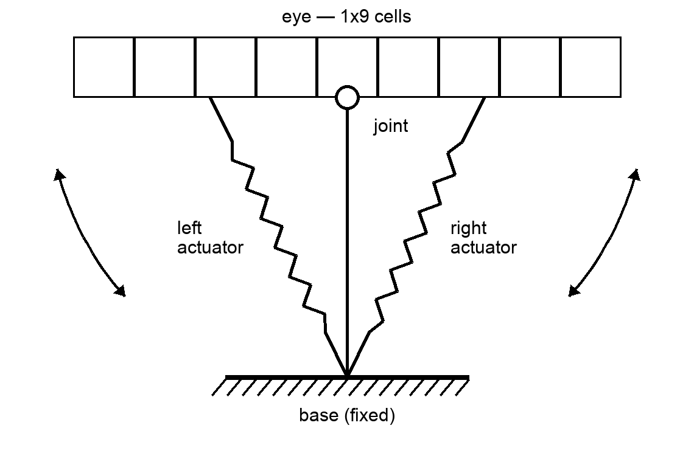
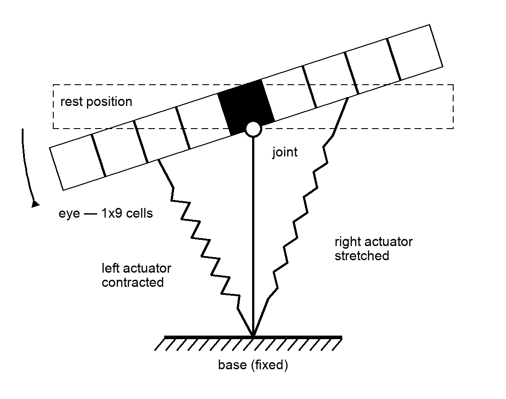
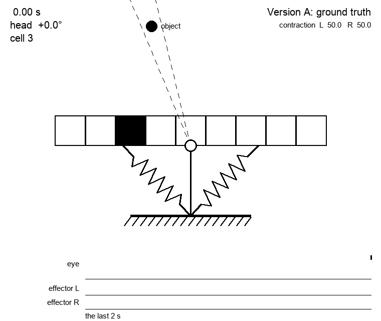
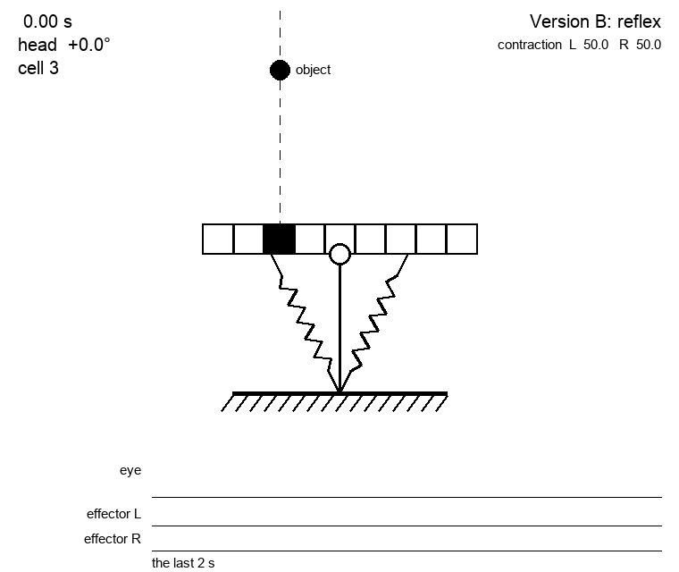

# 005 — Vehicle 1 - a moving eye

- **Status:** draft
- **Date:** 2026-08-25
- **Supersedes / Superseded by:** —

The first of the series of [spec 002](002-vehicles.md), and the simplest one. 

This vehicle has:

- sensors
  - one very simple eye: just an array of 9 cells (1x9) that can have some kind of lateral inhibition (not modeled) that only allow to perceived one cell ON maximum. this is to simulate viewing a source of light.
  - two propioceptive sensors (1x10 sensors each) to sense the level of contraction of each actuator
- actuators
  - one attached to the right of eye and the other to the left (agonist and antagonist) that move the eye.

So the vehicle can't move, it just can move the eye to both sides.

Its shape is a T: the eye is the head, the joint is where the head meets the stem, and both actuators run from the middle of each half of the head down to the middle of the base. The black cell is an object standing in front of the eye, seen here by cell 3:



Contracting one actuator stretches the other and the head turns around the joint, so the eye ends up looking to that side:



The object has not moved — the head has. If each cell covers 9 degrees of the world (a number still to be fixed), turning 18 degrees to the left slides the object two cells along the eye, from cell 3 to cell 5: the eye has centred what it was looking at off to one side.

Those angles are measured from the joint, not from each cell: the eye takes whatever it is looking at to be far enough away that where along the head a cell happens to sit makes no difference to the direction it sees the object in. Something close by — a couple of head lengths away — would break that, and would need the parallax worked out cell by cell. This vehicle does not do it.

Which is worth keeping in mind when reading [spec 001](001-neuromorphic-sensors.md): between those two pictures the eye fires `3 off` and `5 on`, and yet nothing in the world moved. To the retina, moving the eye and the world moving look exactly the same.

## Version A: PID controlled

This version acts as a 'ground truth' testing vehicle, instead of being controlled by neurons, its just controlled by a plain PID controller.

It runs the **same body** as the spiking version: the same T, the same joint, the same head range of ±40 degrees, the same two antagonist actuators. A ground truth that changed the body as well would leave any difference in behaviour unattributable to the brain, which is the one thing it exists to measure. What changes is the controller, and that the controller reads numbers where the other reads spikes.

Its sensors are analog:

- **Eye**: a number from 1 to 9, which cell is active — nothing at all when no cell is.
- **Eye angle**: a number from −40 to +40 degrees, positive when the eye is turned to the left, the same sense as everywhere else in this spec.

Its actuator is the same pair, so what the controller puts out is not a force but a **rate of turn**: degrees per second, positive turning the eye to the left. It is capped at the 80 degrees per second the spiking vehicle manages at its fastest — 100 Hz of spikes into a step of 0.8 degrees. A reference that can outrun the vehicle it is a reference for is not much of a reference.

The task is to bring whatever the eye sees to the middle of the eye, so the error is how far the active cell is from cell 5, in degrees:

```
error = (5 − active cell) × the degrees one cell covers
```

which is positive when the object sits left of centre and the eye has to turn left — positive — to catch it. Counting the error in degrees rather than in cells is what keeps `Kp` meaningful: the width of a cell is still a provisional number, and an error in cells would carry that number into the gain, so changing the width later would silently change how the vehicle behaves.

**When no cell is active the vehicle does nothing.** There is no error to speak of, and it stays where it is until something turns up in front of it.

### It is really a P controller
A PID has three terms and on this body two of them are zero, so it is worth saying which and why.

The plant is a pure integrator: what the controller sets is the rate the eye turns, so the angle is the running total of everything it has ever asked for. On such a plant proportional feedback alone converges exponentially and never overshoots — the eye slows as it closes in, and stops when the error does.

- The **integral** term has no steady-state error to remove, because the proportional term leaves none. All it can do is pile up on the way in and carry the eye past the target, and wind up against the ±40 degree stop whenever the object is out of reach.
- The **derivative** term would be differentiating a nine-step staircase: zero almost everywhere and an impulse at every cell crossing. It would add kicks, not damping, and there is nothing here to damp.

So `Ki = Kd = 0`, and what is left is

```
rate of turn = Kp × error
```

in degrees per second, capped at ±80. With the error in degrees, `Kp` is in units of one over seconds: it is a rate constant, and `1 / Kp` is roughly how long the eye takes to close the gap. **`Kp = 2`**, so the eye takes about half a second to catch what it is looking at.

The output is a plain continuous number — unlike the spiking vehicle, which moves the head in steps of 0.8 degrees, this one turns it smoothly.

The controller runs once every **10 ms**, the same tick as the simulator of [spec 004](004-simulator.md), so that it gets to act exactly as often as the spiking vehicle does and neither is favoured by being asked more often. The interval is a parameter and can be changed — a controller that runs more slowly than the body moves is a different thing to compare against, and a fair one to want.

Changing it is not free, though. The eye slows down as the error shrinks, but only at each tick: between ticks it keeps turning at whatever rate it was last told. So the eye closes `Kp × tick` of the gap on every step, and the pair has a limit — past `Kp × tick = 1` it starts overshooting, and past 2 it never settles. At 10 ms there is room to spare, since that would need a `Kp` above 100. At a tick of a second it would not: `Kp = 2` would be enough to break it.

### The experiment
The run both versions are put through, so that whatever is measured is measured on the same thing:

The object waits **three seconds** where it is, slides **to the left for three**, turns and goes **back to the right for six**, and is then still again. The first stretch is there to let the vehicle settle, so that what follows is a response and not a leftover of the start. The next asks it to keep up with something rather than merely find it once. The turn asks the most of it: following a thing is not the same as following it back, and a vehicle that only ever learned one direction fails exactly there.



Two things worth watching in it, both of them consequences of an error that can only take the values a whole number of cells allows.

The eye comes to rest with the object at the **edge** of the middle cell rather than at its centre: the error is zero anywhere inside cell 5, so the eye stops the moment the object crosses in.

And while the object is creeping left the eye **chatters at the cell boundary** — look at how the eye's row of the raster fills up. Inside cell 5 the error is zero and the eye stands still while the object drifts out of it; the moment it crosses into cell 4 the error jumps a whole cell at once, the eye lunges at three times the speed the object is moving, and puts it back where it was. The head ends up trembling against the edge of a cell, and the eye fires about a hundred times a second over an object that is barely moving.

Which is worth knowing before the number that judges a run is settled: this vehicle is at its noisiest exactly where it is doing best. A faster object is easier on it — it simply settles a cell behind and stays there. Curing the chatter would mean hysteresis, or a dead zone around zero error, and neither is decided yet.

### Open questions

- What counts as success? Time taken to bring the object to cell 5, the fraction of a run spent there, something else. Until that is settled Version A is a vehicle that works, but not yet a measurement anything can be compared against.

## Version B: reflex based
The goal of this version is to evaluate how good can be a controller where the sensory layer and the effector layer are directly connected (without a cortex), so it's reflex based.

Also the connection comes hard wired, no learning is done.

For each cell in the retina there are a cell in the sensory layer that fires when the retina cell fires. This sensory cell is connected with an effector cell, it's is assumed a lateral inhibition mechanisms in the effector layer, so only one effector cell is active (the last activated one).


For this version the Version A retina will be used (it's fires in the busy cell). The spiking eye comes in version C.

### The wiring
Which effector a cell reaches is settled by the task rather than chosen. A cell left of the middle means the object is to the left, so the head has to turn left; and the further out the cell, the further the head has to go, so the further out the cell the faster the effector it wakes. The middle cell reaches nothing — there is nowhere to go from there.

| cell | turns | effector |
|------|-------|----------|
| 1 | left  | the fastest |
| 2 | left  | ↓ |
| 3 | left  | ↓ |
| 4 | left  | the slowest |
| **5** | **nothing** | **none** |
| 6 to 9 | right | the same, mirrored |

Which is four effectors on each actuator, exactly the set spec 003 already gives them, and it is what settles their frequencies: they are the speeds this vehicle picks between.



Watch the two effector rows of the raster: this vehicle moves because something spikes, which is the whole difference from Version A.

## Version C: reflex with neuromorphic retina
This is similar to Version B, but this time the retina is full neuromorphic, so it only respondo to changes.

Remember that in this kind of retina there are two sensor per cell, one that fires when cell moves from empty to busy and other for busy to empty. So if the busy cell moves from cell 1 to cell 3, two events will be triggered: the first is the sensor from cell 1 busy to empty and later the empty to busy of cell 3 (order is important).

In this version the sensory layer is composed of correlation cells which have two inputs, one (the predecessor input) to an busy to empty sensor, and a successor to a empty to busy one, so the fire cells when there is a move from one cell to the other. This layer is fully connected, so there are 72 cells (9 sucessor input times 8 possible predessors).

Each of this cells is connected to an effector cell.

### The order the cells read
The two events of a move only come in an order if something makes them. With the cells of the eye covering the world edge to edge and the object a point, it leaves one cell in the very instant it reaches the next, and both events carry the same time — a correlation cell waiting for its predecessor to arrive first would wait forever.

So a cell reports **becoming busy one cycle after it happens**, and becoming empty at once. A move is then always an OFF and, a cycle later, an ON, which is what this spec and [spec 001](001-neuromorphic-sensors.md) have described from the start.

