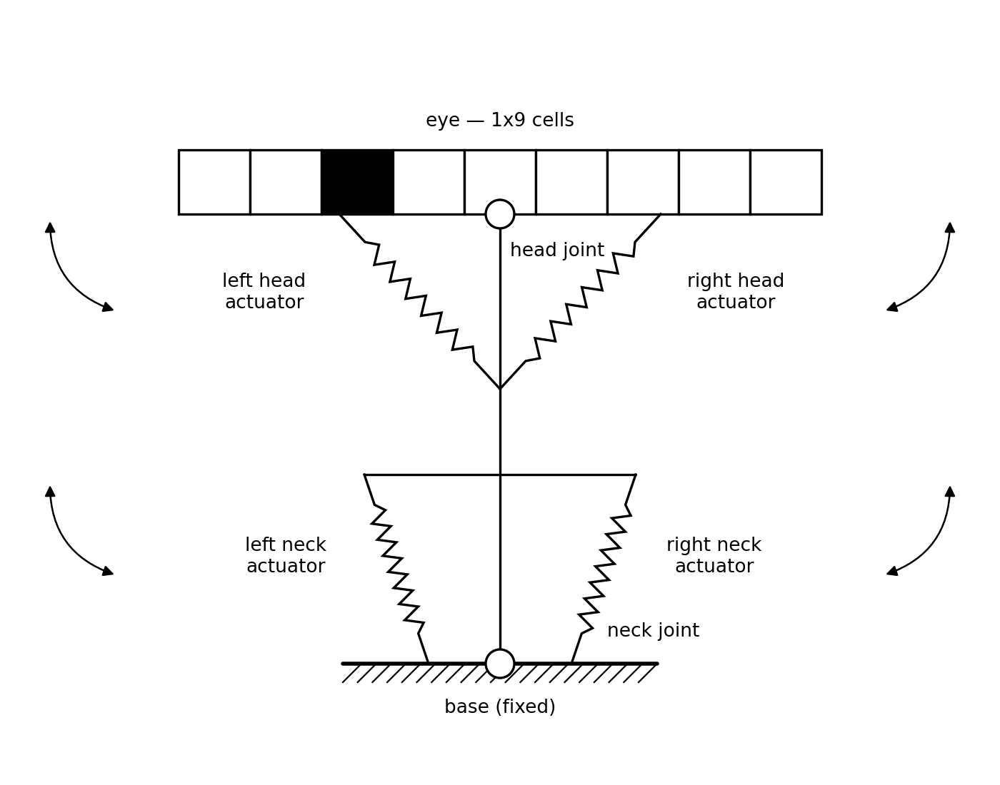
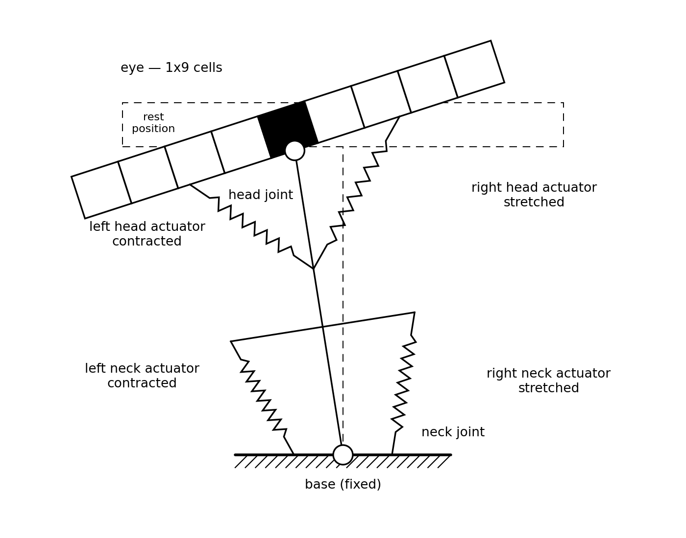
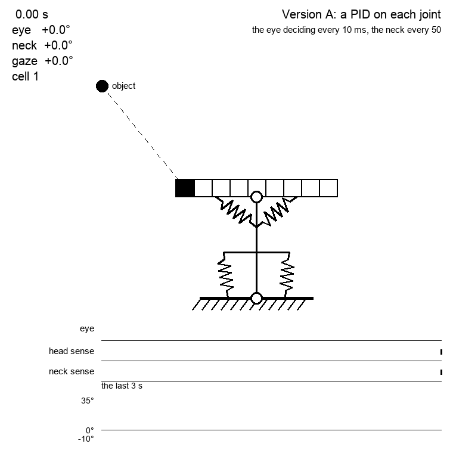
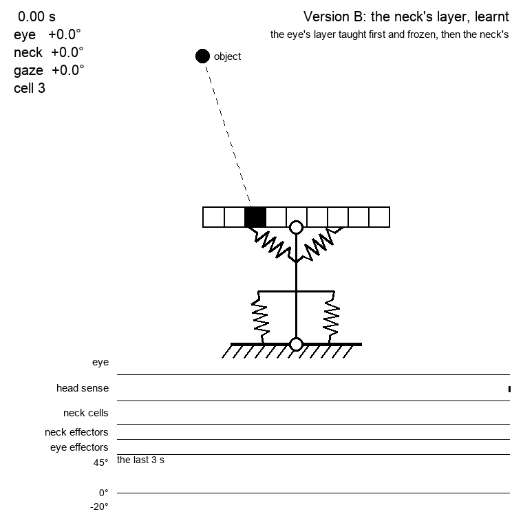

# 006 — Vehicle 2 - an eye on a neck

- **Status:** draft
- **Date:** 2026-09-01
- **Supersedes / Superseded by:** —

The second of the series of [spec 002](002-vehicles.md). It is [Vehicle 1](005-vehicle-1.md) with one thing added: a second joint underneath the first, so that the eye is carried on a neck.

This vehicle has:

- sensors
  - the same eye as Vehicle 1: an array of 9 cells covering 9 degrees of the world each, at most one of them busy
  - four propioceptive sensors (1x10 each), one per actuator
- actuators
  - four, in two antagonist pairs: one pair turns the eye on the head joint, the other turns the whole neck on the base.

It still cannot go anywhere. What it has that Vehicle 1 has not is a second way of pointing the same eye.

## The body

Its shape is a T standing on another T. The upper one is Vehicle 1 entire — the eye is the head, the head joint is where it meets the neck, and the two head actuators run from the middle of each half of the eye down to the neck. The lower one is new: the neck is a rigid link from the head joint down to the base, with a cross bar of its own near the bottom, and the two neck actuators run from the ends of that bar down to the base. The black cell is an object standing in front of the eye, seen here by cell 3:



The neck actuators reach the base on either side of the joint, and not the joint itself. An actuator that ends at the pivot keeps its length whatever the pivot does, so it could never turn it — the head actuators get away with converging on a single point because that point is on the neck, far below the joint they act on. It is the first piece of geometry in this project that had to be got right rather than merely drawn.

## Both joints, one gaze

Turning either joint turns the eye, so what the eye ends up looking at is the sum of the two angles:

```
gaze = neck angle + head angle
```

Here both are turned 9 degrees to the left, which is 18 degrees of gaze:



That is the same 18 degrees as the turned picture of Vehicle 1, and it has the same consequence: the object has not moved, and it slides two cells along the eye, from cell 3 to cell 5.

Which is the whole difficulty of this vehicle, and it is worth stating as plainly as the pictures do. **The retina cannot tell the two joints apart.** Cell 3 going empty and cell 5 going busy is what a neck of 18 degrees looks like, and a head of 18 degrees, and any of the infinitely many pairs in between — including the two turned against each other by more than that and cancelling. One percept, many postures. Vehicle 1 had a body with one degree of freedom and one thing to see it with; this one has two degrees of freedom and the same one thing, so for the first time the vehicle's own state is not recoverable from what it sees.

The propioceptive sensors are what is left to tell them apart, four of them now instead of two, and telling them apart is their whole job. This is also the first vehicle where the sensory layer's task — tie a movement to what it did to the world — has two sources of movement to keep separate.

## The two joints are not alike

If both joints were the same, the redundancy would be the only new thing here and the choice between them arbitrary. They are not the same, in the two ways they are not the same in a human: **the eye is quick and short of travel, the neck slow and long**. The numbers below are the human ones, rounded, then what they become in the units of [spec 003](003-neuromorphic-actuators.md) and [spec 004](004-simulator.md).

| | human eye in the orbit | human head on the neck |
|---|---|---|
| range | ±45 to 50° | ±70 to 80° |
| range in customary use | ±15 to 20° | ±45° |
| peak speed | 300 to 500 °/s, saturating near 700 | 100 to 200 °/s in natural gaze shifts |
| how long one movement takes | 30 to 100 ms | 300 to 800 ms |
| latency | about 200 ms | starts 20 to 80 ms *after* the eye |
| rate of the motoneurons | bursts of 400 to 1000 spikes/s | 10 to 30 Hz sustained |

The eye is three to four times the faster and the neck close to twice the travel. Those two ratios are what this vehicle is asked to keep:

| | head joint | neck joint |
|---|---|---|
| range | ±45° (5 cells) | ±80° |
| range in customary use | ±20° | ±45° |
| degrees per spike | 0.9 | 1.6 |
| fastest effector | 500 Hz for 40 ms → **450 °/s**, a jerk of 16° | 100 Hz for 400 ms → **160 °/s** |
| the ladder, Hz × ms | (500, 40) (250, 80) (100, 200) (20, 500) | (100, 400) (50, 600) (20, 1000) (5, 1000) |
| one propioceptive level | 9°, one cell of the eye | 16°, near two |
| one babble of 0.5 s at 20 Hz | 9°, one cell | 16°, near two |

Three things fall out of that table, and each is a decision rather than an implementation detail.

**The eye reaches the ceiling of spec 004.** 450 degrees a second at 0.9 per spike is 500 Hz, which is exactly `MAX_RATE_HZ`, the rate the 2 ms refractory period allows and nothing more. Spec 004 says that nothing built so far comes near it and that the fastest effector runs at 100 Hz; the eye of this vehicle is the first thing to touch it. That is the right place to be, because it is where the biology is: the burst neurons that drive a real saccade fire at 600 to 1000 spikes a second and are the fastest thing in the motor system. The alternative — a bigger step at a lower rate — buys the same speed and loses the tie between one spike and one cell, so it is not taken.

**A saccade is a jerk, not a movement that is held.** The head's fastest effector runs for 40 ms and no longer, which is the whole of its command: 18 spikes, 16 degrees, and over before anything could stop it. That is what the `duration` of spec 003 is for, and this is the first vehicle to use it as biology does.

**The two joints are coherent internally and coarse against each other.** The head's step, its propioceptive level and its babble all come to about one cell of the eye, which is the scale spec 004 asks for. The neck's all come to about two. So the neck is not sloppier in some places and sharp in others — it is uniformly the coarser joint, which is also true of a human, whose sense of where the eye is sitting is barely propioceptive at all. What it costs is that the two modalities no longer have the comparable resolution spec 004 was careful to give them: for the neck, one level of contraction spans nearly two cells of retina.

## What decides which joint moves

In a human the answer is usually given as a threshold on the world: gaze shifts under about 20 degrees are made by the eye alone, and past that the head is recruited. Then the two come apart again — the eye lands first, the head is still arriving, and the eye rolls back towards the middle of its range while the gaze stays where it was put.

That second half is the useful one. A head that has re-centred its eye has spent its neck to buy back the eye's range, and is ready for the next thing to appear anywhere. It is also what makes the two joints worth having: not a longer reach — the neck alone would give that — but a fast joint that is always near the middle of its travel, kept there by a slow one.

And it turns out to be the whole of it. Nothing has to decide which joint moves, because the two are not choosing between the same jobs.

## Version A: a PID on each joint

The same thing Version A of [spec 005](005-vehicle-1.md) is — a ground truth, reading the active cell as a plain number and turning the body itself, with no spike anywhere in it — but there are two joints to drive now, so there are two controllers, and they do not read the same thing.

**The eye keeps Vehicle 1's, unchanged.** The same proportional law, the same `Kp`, the same error in degrees from the middle of the eye. One thing follows the body rather than the controller: the cap. Vehicle 1's is 80 degrees a second because that is what its fastest effector manages, and by the same rule the head joint's is 450.

**The neck's does not read the eye's picture at all.** What it reads is the head joint's own angle — how much of the looking the eye is doing — and what it asks for is that the neck take that over:

```
neck rate = Kr × how far the eye is outside its comfortable range
```

`Kr` is 1 per second against the eye's 2, so the eye is given its range back in about a second and catches up with anything in half of one: giving the range back is never allowed to compete with the catching. Below `HEAD_COMFORT_DEG` the neck asks for nothing — an eye a few degrees off its middle is not worth moving a neck for, and a human's sits there all day — and past it, what is acted on is what is left once that range is subtracted, so the neck starts from nothing at the edge instead of lurching into motion.

So each of the three parts has one job. **The eye decides where to look, and is the only thing that sees. The neck decides how the looking is held, and is the only thing that reads the eye. The VOR, which is not a controller at all but a wire, keeps the second from disturbing the first.**

### What the neck is not told, and why

It was told, at first. The neck had a second law reading the same retina as the eye, deaf until the object was more than 20 degrees out and helping to swing the gaze past that. It worked. It is also what a human does, and the version of the threshold everybody quotes.

It was taken away because it gave the neck two inputs and two jobs, and because the threshold it needed was a fact about the world that nothing inside the vehicle could justify. What that costs is small and worth writing down: an object at the far edge of the eye is caught in 979 ms instead of 925, and on the experiment of spec 005 nothing changes at all, the object never getting far enough out for the second law to have spoken.

What it buys is that the threshold left over is about the eye's own posture. Which is what the human number means underneath: the head is not recruited because the target is far away, it is recruited because the eye has ended up outside the range it is content to work in. The two coincide when the eye starts centred, which is why it is usually quoted as a gaze shift — and the propioceptive version is the one that stays right when it does not.

### The eye has to give way, and has to be told

A neck that turns while the gaze is meant to stay put needs the eye to turn back by exactly as much. The eye cannot work that out from what it sees. Inside a cell there is no error to see — that is what a nine degree cell means — so it would not notice the gaze drifting until the object had crossed into the next one, and would then lunge back a whole cell at once. That is the chatter of Version A of spec 005, this time self-inflicted, and it is what the vehicle does if left to find out for itself:

| over five seconds | out of the middle cell | events the eye fired |
|---|---|---|
| the eye told what the neck is doing | 0 ms | 9 |
| the eye left to see for itself | 1128 ms | 260 |

So the eye is handed the neck's rate and cancels it — the whole of it, the neck having nothing else to say. That is a **vestibulo-ocular reflex**, and one thing about this one has to be admitted: a real VOR reads a canal, a sensor of head velocity, which this vehicle has not got, its propioceptive arrays reporting a position. What stands in for the canal here is a copy of the command, so this is the first thing in the project that is fed forward rather than sensed.

### What it does

The object stands still at 36 degrees, at the far edge of the eye. It is caught in 979 ms whatever the comfortable range is set to, the eye doing that part alone. What the range settles is where the two joints come to rest afterwards:

| `HEAD_COMFORT_DEG` | at 1 s | at 3 s | at 5 s |
|---|---|---|---|
| 0° | eye 17.2, neck 14.3 | eye 2.3, neck 29.2 | eye 0.3, neck 31.2 |
| 10° | eye 23.2, neck 8.3 | eye 11.8, neck 19.7 | eye 10.2, neck 21.3 |
| 20° | eye 28.4, neck 3.1 | eye 21.1, neck 10.4 | eye 20.2, neck 11.3 |



Eleven seconds of the first row of that table, the comfortable range set to nothing so that the handover is complete. The vehicle catches the object with its eye; spends the next five seconds changing which joint holds it, the object sitting in the middle cell throughout and the neck ending up pointing very nearly at it; and then the object leaves, sliding away to the right at five degrees a second.

That last stretch is the two loops settling into the regime they settle into whenever something has to be watched rather than glanced at: **the eye parks a fixed few degrees off its middle and the neck does the following.** The parking angle is not a setting. The neck can only move at `Kr` times how far the eye is off centre, so for the neck to keep up with five degrees a second the eye has to stand five degrees out and stay there — the speed divided by `Kr`, which is what the picture shows to a tenth of a degree.

The three rows underneath are what the vehicle itself has to go on: the eye fires a handful of times in the whole run, and the two propioceptive arrays — one sensor of ten firing at a time, drawn at the height of whichever it is — walk in opposite directions as the neck takes over. The traces at the bottom are the ground truth, which it does not have.

That picture is also what found the one bug this vehicle has turned up so far. The head's row fell silent as the eye came home, and it was not the drawing: the ten sensors of [spec 001](001-neuromorphic-sensors.md) ran from 0 to 10, then 11 to 20, and so on, leaving a unit of gap between each pair — so a contraction between 50 and 51 was read by nobody. A vehicle that moves in whole steps never lands in a gap, and none of them ever had; Version A turns its joints continuously and landed there about a tenth of the time, including at exactly the level an eye that has come back to its middle rests at. The ranges are half open now, which is the convention the cells of the eye were already tiled with.

The gaze is 31.5 degrees in every one of those cells and the object never leaves the middle of the eye. Nothing about the task is done better or worse. What the range buys is how much of its travel the eye has left when the vehicle is done: all of it at zero, half of it on one side at twenty. It is a decision about posture and not about performance, which is the sort of number this project should be explicit about having chosen.

It shows as an ability rather than a posture as soon as the object goes somewhere the eye alone cannot follow. Sliding left at 10 degrees a second for nine seconds, from 18 degrees out to 108, the vehicle settles into following it with the neck at 10 degrees a second and the eye parked a fixed few degrees off its middle — which is what a human does with anything that has to be watched for longer than a glance. It keeps the object within a cell of the middle until the neck runs out of range at 80 degrees, and ends with the object in cell 4 and its eye still 15 degrees from its stop.

## Version B: the same circuit on each joint

Version A is two controllers reading numbers. This one is two layers of cells reading spikes, and they are the same layer twice.

**The eye's is [Version D of spec 005](005-vehicle-1.md), unchanged.** Seventy two correlation cells over the retina, a weight from every cell to every effector, credit handed out by the partition, and babbling for as long as no weight is worth anything.

**The neck's is that circuit with its inputs moved.** A correlation cell has a predecessor input and a successor input, and in the eye's layer they are wired to a cell of the retina going empty and another going busy. In the neck's they are wired to the head joint's **propioceptive array** — one of its ten sensors going out of range and another coming into it. So a cell of this layer does not say *the object moved from there to here*, it says *the eye did*; and better is not the object nearing the middle of the eye but the eye nearing the middle of its own range.

Nothing in the circuit knows the difference. That is the point of trying it.

Two things had to be settled to point it at a body instead of at the world, and both are properties of the array rather than of the circuit:

- **The array is tonic.** [Spec 001](001-neuromorphic-sensors.md) has it keep firing for as long as the level stays where it is, which says the same thing over and over, while a correlation cell asks when something *arrived*. So only the first ON after an OFF is passed on — a cell per sensor, firing on the edge of its input and deaf while it holds.
- **It has ten sensors and therefore no middle one.** The partition takes the middle to be 5.5: a place to be near rather than a cell to be in. Everything else about `outcome` is untouched, and the eye, with its nine, is judged exactly as before.

### One at a time, and the eye first

The eye's layer is taught alone and **frozen** before the neck's begins. Both halves of that are necessary, and for different reasons.

A neck that babbles while the eye is being taught makes the object appear to move, and Version D is taught against an object that never moves for exactly that reason — so that every change on the retina is the vehicle's own doing and the credit is clean. Taught together, the pair ends up worse than the eye on its own, and by a lot.

And a neck has nothing to learn from until the eye works. Contracting a neck actuator does not move the head joint at all: it swings the gaze, the object lands on another cell of the eye, the eye's own layer turns the eye, and only *then* does the neck's input move. The neck is learning the consequence of a consequence, through another learner, and if that learner does nothing the chain does not exist.



Fifteen seconds of one of the better seeds: the eye near the middle of its range, the neck carrying the gaze, both sets of effectors firing. It is the same division of labour Version A settled into, arrived at this time by two layers of cells that were told nothing about each other.

### What the neck's layer learns

To ask what the layer found, rather than what the pair manage, the chain it depends on has to be made reliable — so the head is driven by the ground truth of Version A and only the neck is left to its layer. Taught 120 seconds against a still object, then put through the experiment of spec 005:

| the head on Version A, the neck as marked | in the middle | mean \|eye\| |
|---|---|---|
| a neck that never moves | 12.37 s of 15 | 16.6° |
| Version A's neck | 12.37 s | 3.2° |
| the layer it learnt, over three seeds | 6.96, 1.62, 9.45 s | 7.1, 6.7, 2.3° |

The right hand column is the result. **The neck does bring the eye home** — the eye ends up half as far off its middle, or better — and of the sixteen or so cells that ever fire, 13 of 16, 15 of 16 and 15 of 16 chose the side that brings it back. From nothing but its own babbling and a partition over its own sensors, the layer works out that the neck must turn the way the eye is turned. That is the same kind of claim Version E of spec 005 makes: not how well it did, but what it understood.

The middle column is what it costs, and the cost is the missing reflex. Every movement of the neck swings the gaze and nothing tells the eye it is coming. Version A handed the neck's rate straight to the eye — a vestibulo-ocular reflex, a wire and not a controller — and there is no such wire here. The eye finds out the way it finds out about everything, by the object turning up on a different cell, and by then it has been dragged most of a cell away. **Twelve seconds of fifteen with a VOR, seven without**: that is the number.

### On the eye it actually has, it is worse than the eye alone

That was with a ground truth eye underneath. On the eye Version D produces, over six seeds taught 120 seconds a stage:

| | in the middle | mean \|eye\| |
|---|---|---|
| the eye's layer alone | 4.81 s of 15 | 10.4° |
| with the neck it then learnt | 1.50 s | 19.0° |

Both worse. And it is not the pre-training that fails — the layer is taught exactly as it was in the rig above, on a frozen eye that has already been schooled. What fails is the eye. Teaching the same neck on the ground truth gives 13, 15 and 15 of 16 cells the right way; teaching it on the learnt eye gives 12 of 17, 5 of 17 and 15 of 16. A learner that has to reach the world through another learner inherits its noise, and Version D's eye is noisy: over those six seeds it holds the object for anywhere from 0.00 to 10.22 seconds, a spread wider than anything the neck does to it.

So the honest reading of this version is that **the neck's circuit works and the vehicle does not**, and what stands between them is the quality of the eye it has to act through.

### What one command is worth

There is a second reason, and it is not about learning at all. An effector runs its own duration, so what a single command comes to is `frequency × duration × degrees per spike`:

| the neck's ladder | one burst | | the eye's ladder | one burst |
|---|---|---|---|---|
| 100 Hz for 400 ms | **64°** | | 500 Hz for 40 ms | 18° |
| 50 Hz for 600 ms | 48° | | 250 Hz for 80 ms | 18° |
| 20 Hz for 1000 ms | 32° | | 100 Hz for 200 ms | 18° |
| 5 Hz for 1000 ms | 8° | | 20 Hz for 500 ms | 9° |

The neck's fastest command moves it sixty four degrees — four fifths of its whole range — in one go, which is enough to throw the object clear off an eye that only spans eighty one. Version A never did that, because a controller sets a rate and decides again a millisecond later; a spiking layer picks a burst and lets it run to the end. The teeth on the gaze trace in the picture above are that, at the gentler end of the ladder.

Those durations were chosen to match how long a human head turn takes, and the frequencies to match how fast one goes. What nobody checked is what the two come to multiplied together, which is the only number that matters to something that decides once per movement. Keeping the speeds and shortening the bursts — 100 Hz for 100 ms, and so on down — gives 16, 16, 8 and 3 degrees, and on the ground truth rig it changes the vehicle's character entirely:

| | in the middle | mean \|eye\| |
|---|---|---|
| the ladder as specified | 6.96, 1.62, 9.45 s | 7.1, 6.7, 2.3° |
| the same speeds in shorter bursts | 11.99, 9.94, 10.66 s | 5.9, 24.8, 14.6° |

Twelve seconds is what a neck that never moves scores, so the task comes back almost entirely — and the eye is left further out. It is the same exchange as the VOR one seen from the other end: with nothing cancelling the gaze a neck movement causes, every degree the neck buys back for the eye is paid for in gaze, and **how far one command moves the neck is the exchange rate**. Neither end of it is free, and this vehicle has no way of pricing either.

## Acceptance criteria

- [ ] The body has four actuators in two antagonist pairs, and four propioceptive sensors, one per actuator.
- [ ] The eye is the one of Vehicle 1, unchanged, and it is reached by neither joint directly: what it reports is the sum of the two angles and nothing else.
- [ ] With both joints at 9 degrees, the object of the pictures reads `3 off` then `5 on`, exactly as Vehicle 1 does at 18 degrees.
- [ ] The head joint stops at ±45 degrees, the neck at ±80, and the gaze therefore at ±125.
- [ ] The head's fastest effector turns the eye at 450 °/s and its slowest at 18, the neck's at 160 and 8.
- [ ] No effector exceeds the 500 Hz the refractory period of spec 004 allows.
- [ ] The cortex still cannot read either angle or any contraction, by construction — spec 004 stands unchanged.
- [ ] Version A drives both joints without a spike passing anywhere in it.
- [ ] Neither of its joints turns faster than its own fastest effector, and neither leaves its range.
- [ ] Its neck reads the head joint's angle and nothing else: which cell is busy makes no difference to what it asks for.
- [ ] With no comfortable range set aside, the neck ends up holding the whole gaze and the eye ends within a couple of degrees of its own middle.
- [ ] It does that without the object leaving the middle cell of the eye.
- [ ] Either joint may turn back on itself; the gaze may not.
- [ ] Version B's two layers are the same class of cell, told apart only by what they are wired to.
- [ ] The neck's layer never reads the retina, and the eye's never reads a propioceptive array.
- [ ] A sensor that goes on reporting the same level produces one arrival, not one per spike.
- [ ] Taught against a ground truth eye, most of the cells the neck's layer learns choose the side that brings the eye back towards the middle of its range.
- [ ] The eye's layer is frozen before the neck's is taught, and nothing teaches both at once.

## Open questions

- **What is the comfortable range, and does anything have to decide it?** Version A no longer needs anything to choose between the joints — the eye moves because it sees, the neck moves because the eye moved — but it is still handed a number saying how far off centre an eye may sit before its neck is worth troubling. What would settle that number honestly is a vehicle that pays for moving, the neck being the expensive joint: with `ACTING_COSTS` of spec 005 charging for spikes, a range that is too small is measurable as waste rather than a matter of taste.
- **How does the eye re-centre on spikes?** Version A does it by reading the head's angle as a number and handing the eye a copy of the neck's command. Neither is available to a spiking vehicle. The angle would have to come from the head's 1x10 propioceptive array, which resolves 9 degrees a level, so the giving back would happen in steps of a whole cell rather than smoothly. The copy of the command is worse: there is nothing to copy, the command being spikes to an actuator, so either the effectors reach the eye's own effectors directly — a reflex arc, which is what the real one is — or the vehicle needs the velocity sensor it has not got.
- **What would a VOR made of spikes be?** Version B measures what its absence costs — half the time on target. The arc it is missing goes from the neck's effectors to the eye's, and it is a reflex rather than anything learnt, so it could be wired. Whether it can instead be *learnt*, by a layer whose inputs are the neck's own effectors, is the more interesting question and the one this project would rather ask.
- **What should one command be worth?** [Spec 003](003-neuromorphic-actuators.md) gives an effector a frequency and a duration and says what each is for, and nothing anywhere says what their product should be. For a joint driven by a controller it does not matter; for one driven by a layer that picks a burst and lets it run, it is the whole of what a decision costs. The eye's ladder lands on one or two cells by luck rather than by design.
- **In what order should the two be taught?** Nothing in the vehicle says the eye must be schooled first, and everything in the measurements says it must. A rule imposed from outside is not a rule the vehicle has, so either something in it has to want the order, or the two have to be made teachable at once.
- **Can the sensory layer keep the two apart?** Its correlation cells tie a movement to what it did to the eye, and there are now two movements that do the same thing to it. Four propioceptive sensors say which one happened; whether the correlation cells can use that, or need a second input, is not settled.
- **Does babbling still work with four actuators?** Two unwired pairs babble at once, and the eye sees the sum. Some of the credit for what changed then belongs to a joint that happened to move at the same time, which is exactly the confusion Version D of spec 005 was taught against a still object to avoid.
- **Is one step size per joint enough?** The neck's 1.6 degrees was chosen to give it ±80 out of the same contraction range, not because anything wanted a coarser step. Giving it a longer contraction range instead would keep the step, and would say that the neck is a bigger muscle rather than a rougher one.
