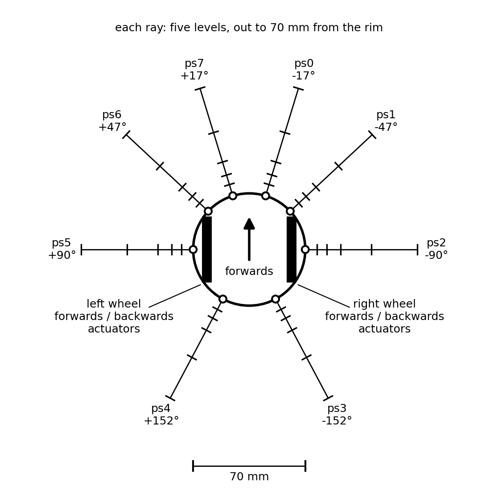

# 007 — Vehicle 3 - a body that goes somewhere

- **Status:** draft
- **Date:** 2026-09-19
- **Supersedes / Superseded by:** —

The third of the series of [spec 002](002-vehicles.md), and the first that is not this project's own invention. Vehicles [1](005-vehicle-1.md) and [2](006-vehicle-2.md) are an eye that turns; neither can go anywhere. This one is an **[e-puck](https://www.gctronic.com/doc/index.php/e-puck2)**: a disc on two wheels with a ring of proximity sensors, built by the thousand, modelled in every robot simulator there is, and as close to the vehicles of Braitenberg's book as anything that can be bought.

It is taken as it comes for two reasons. What is done on it can be compared with what others do on it — the [demonstration](https://x.com/alexanderawolf/status/2097720062937346451) that prompted [spec 012](012-joint-primitive.md) is an e-puck avoiding obstacles — and what works on it has somewhere real to go afterwards. So nothing about the body below is a choice of this project except what is left out.

This vehicle has:

- sensors
  - eight proximity sensors in a ring around the body, each a 1x5 array of levels
  - no propioceptive sensors at all
- actuators
  - four, in two antagonist pairs: one pair per wheel, one turning it forwards and one backwards

## The body



| | the e-puck | here |
|---|---|---|
| body | a disc, 70 mm across | the same |
| wheels | 41 mm across, 53 mm apart | the same |
| motors | steppers, 20 steps a turn through a 50:1 gear: **1000 steps a turn of the wheel** | one spike, one step |
| one step | 0.129 mm of floor | the same |
| one step of one wheel, the other still | the body turns 0.139° | the same |
| fastest | 1200 steps/s, 15.4 cm/s | **500 steps/s, 6.4 cm/s** |
| proximity | 8 infra-red sensors, good to about 6 cm | 8 arrays of 5 levels, out to 7 cm |
| also carries | a camera, a time-of-flight ranger, an IMU, four microphones | none of them |

Positions are in millimetres and headings in degrees, positive to the left as everywhere in this project.

## The wheels were already neuromorphic

A stepper motor does not take a speed. It takes pulses, and moves one fixed step on each, and how fast it turns is how often they come. Which is [spec 003](003-neuromorphic-actuators.md) word for word — *it just receives spikes and moves a little on each one* — written about a muscle by somebody who was not thinking of steppers. So there is nothing to translate: **a spike is a step**, the step is the 0.129 mm the hardware has, and an effector at `f` Hz rolls its wheel at `f × 0.129` mm a second.

Four things follow, and the first three are this body disagreeing with a spec.

**A wheel is two actuators.** An actuator of spec 003 moves one way only, and a wheel turns both. So each wheel is an antagonist pair, a forward actuator and a backward one acting on the same axle, exactly as the two actuators of Vehicle 1 act on the same joint. A spike to each in the same tick is a step each way and the wheel stays where it was.

**It has no range and does not relax.** Spec 003 gives an actuator a span from relaxed to fully contracted and has it go slack when the spikes stop. A wheel has no end to reach and a stepper that is not stepped holds still. Both parameters are simply absent here, which answers for this body the open question of what happens at the end of the range: there is no end.

**It has no propioception, and that is the hardware's doing.** A stepper is driven open loop; the e-puck has no encoders, and knows how far a wheel has turned only by having counted the pulses it sent. With no range there is also no level for a threshold sensor of [spec 001](001-neuromorphic-sensors.md) to report. So this is the first vehicle with no sense of its own body at all. Whatever it comes to know about what its movements do, it knows from what they do to the ring.

**The ceiling is below the hardware.** The refractory period of [spec 004](004-simulator.md) caps any cell at 500 Hz and the motors can take 1200. [Vehicle 2](006-vehicle-2.md)'s eye was the first thing to touch that ceiling; this is the first body the ceiling holds back. It is left that way. Going faster would take two effectors firing into one actuator with their rates adding, which spec 003 leaves open and every vehicle so far has assumed does not happen. At 500 Hz:

| | |
|---|---|
| both wheels forwards | 64 mm/s, a little under a body length a second |
| one wheel, the other still | 70 °/s, pivoting about the still wheel |
| one forwards, one backwards | 139 °/s, on the spot |

The ladders of the four actuators are not fixed here. They belong to the versions, and under [spec 012](012-joint-primitive.md) to the body's own effectors, to be found rather than cut.

## The ring

Eight sensors, at the places the e-puck has them, named as the e-puck names them:

| | `ps0` | `ps1` | `ps2` | `ps3` | `ps4` | `ps5` | `ps6` | `ps7` |
|---|---|---|---|---|---|---|---|---|
| looks towards | −17° | −47° | −90° | −152° | 152° | 90° | 47° | 17° |
| | right front | right | right side | right rear | left rear | left side | left | left front |

Each looks straight out from the rim along one ray, and what reaches it is what the real sensor measures: how much of its own infra-red comes back, which falls off steeply with distance. The numbers are the ones measured for the e-puck and shipped with its [Webots model](https://github.com/cyberbotics/webots/blob/master/projects/robots/gctronic/e-puck/protos/E-puckDistanceSensor.proto), from 4095 touching to 67 at 70 mm, with nothing past that.

**Each sensor is a threshold based array of spec 001**, five elements, each firing tonically at 50 Hz while the return is inside its own range, the ranges tiled half open like every other array here. The element model of spec 001 works on the log of what it measures, so the five ranges are equal steps of log intensity, a factor of 2.28 each — and the consequence is that they are nothing like equal in distance:

| level | return | the thing is | deep | crossed at full speed in |
|---|---|---|---|---|
| — | under 67 | further than 70 mm, or not there | | |
| 1 | 67 to 153 | 70 to 41 mm away | 29 mm | 447 ms |
| 2 | 153 to 348 | 41 to 22 mm | 19 mm | 298 ms |
| 3 | 348 to 791 | 22 to 13.5 mm | 8.5 mm | 133 ms |
| 4 | 791 to 1800 | 13.5 to 7.3 mm | 6.2 mm | 96 ms |
| 5 | 1800 and up | nearer than 7.3 mm | 7.3 mm | 113 ms |

Fine where it matters and coarse where it does not, with nobody having designed it so: it is what a log does to a signal that falls off like this one. The narrowest level still takes 96 ms to cross at full speed, five periods of the array, so nothing can pass through a level unreported.

An address is `(sensor, level)`. It is a propioceptor pointed outwards, with one difference that matters. A contraction is always somewhere, so exactly one element of a propioceptor is always firing. A sensor of this ring with nothing in front of it has **no element firing at all**, and a vehicle in the open is forty lines of silence, which is property 6 of spec 001 kept by a tonic array for once. What it costs is that *nothing there* is not a line, and a table of coincidence cells cannot be told about an absence — the adapter Version B needs, below.

Left out, each to be put back when something wants it: the noise the real sensor has, which the Webots table also gives; the width of the beam, a single ray seeing neither a thin post between two rays nor a wall at a glancing angle the way the real one does; and the colour of the thing, to which infra-red is far from indifferent.

## The world

Vehicles 1 and 2 live opposite one object at some bearing, and `world.py` is that bearing. This one needs a floor:

- an **arena**, a rectangle of walls;
- **obstacles** inside it, discs and boxes, which do not move;
- a **pose** for the vehicle, `(x, y, heading)`, which is ground truth and which, like the head angle of [spec 004](004-simulator.md), nothing in the vehicle may read.

Spec 004 says *no physics engine*, the body of Vehicle 1 being one angle. It can go on saying it. This body is three numbers and the whole of its physics is two rules:

**A step moves the pose exactly.** A step of the left wheel alone turns the body 0.139° to the right about the right wheel's point of contact, a step of the right the other way, one of each in the same tick moves it 0.129 mm straight ahead. No inertia, no slip, no momentum: the body is where its steps have put it. Which makes it, like the head of Vehicle 1, a pure integrator, and keeps the argument of [spec 005](005-vehicle-1.md) about what gains such a plant can stand.

**A step into something is lost.** If a step would leave the disc overlapping a wall or an obstacle it is not taken, the pose stays where it was, and the step is counted. A real stepper does just this — it stalls, loses the step, and nobody is told. Lost steps are the collisions of this vehicle, and the only injury it can do itself.

### The experiment
An arena of 1000 by 700 mm, with a disc of 60 mm radius at (300, 450), a disc of 40 at (650, 200), and a box of 200 by 40 centred at (700, 520) and turned 30°. The vehicle starts at (150, 150) heading 20°, and runs **120 seconds**. All of it provisional, and chosen so that a vehicle going straight meets something within five seconds whichever way it sets off.

What is measured, by the observer:

| | |
|---|---|
| **how far it went** | the length of the path of its centre. At most 7.7 m |
| **lost steps** | how many, and in how many separate bouts |
| **ground covered** | of the 50 mm squares of free floor, the fraction its centre entered |
| **longest standstill** | the longest stretch in which its centre stayed within 10 mm |

Four numbers because any one of them can be gamed by a vehicle doing something stupid: standing still loses no steps, spinning on the spot never stands still, and running round the wall covers distance and no ground.

## What it is asked to do

Go, and do not hit things. It is Braitenberg's Vehicle 3b, the one he calls the explorer: each sensor *inhibits* the motor on the *opposite* side. In the open both wheels run flat out. Something on the left slows the right wheel, the body swings right, away from it, and the nearer the thing the harder the swing. Nothing in it knows what an obstacle is.

That the numbering of this project and of the book coincide here is an accident, and a pleasing one.

## Version A: a P controller on each wheel

The ground truth, as Version A is in specs 005 and 006: it reads numbers, moves the body itself, and no spike passes anywhere in it.

Each wheel reads the three forward sensors of the **opposite** side — for the right wheel `ps7`, `ps6` and `ps5` — takes the nearest thing any of them sees, and turns that into a **closeness** `c`: the log of the return on the scale of the table above, 0 for nothing in range and 5 for touching, as a plain number and not a whole level. Then:

```
wheel rate = K × (r − c)      steps a second, no faster than 500 either way
```

`r` is the closeness the wheel is content with, 3, and `K` is 167 steps a second a level, which is what makes `K × r` the 500 the body can do: in the open `c` is 0 and both wheels run at the cap. At `c = 3`, a thing 22 mm off, the wheel stops; nearer than that it runs backwards.

So it is the law of [spec 011](011-neuromorphic-p-controller.md), `o = k × (p − r)`, with nothing changed but the sign, and the explorer of the book turns out to be two proportional controllers that each want something a comfortable distance from the far side of the body and are never given it. Which is what makes this vehicle a fair test of spec 012: **a wheel is a joint.** An antagonist pair, a `p` that is a line among several, an `r`, and a ladder.

The two rear sensors are read by nothing. A body that cannot see behind itself and can reverse is a body that will back into things, and the lost steps will say how often.

## Version B: the same, in cells

Four copies of the primitive of [spec 012](012-joint-primitive.md), two a wheel, wired. Three things stand between the ring and their sockets, and none of them is part of a copy:

- **The nearest of three.** A row of five lines a side, line `k` excited by level `k` of any of that side's three forward sensors, each line silencing every line below it. *The nearer silences the farther* is the rule spec 012 already needs for its wide reference, met again.
- **A line for nothing.** A copy is told `p` by a line that fires, and in the open none does. So the row has a sixth line: a memory cell that is never cleared, silenced by any of the five. It is the vehicle's drive, in the sense that it is the only reason a wheel ever turns — *nothing near* set against *wanting something at level 3* is an error of three levels, and the wheels run. A vehicle with that cell removed sits in the middle of the floor for ever, content.
- **The reference**, a row of six with the fourth line set, by the observer, as in Version F.

Then each wheel is a joint of spec 012 with `N = 6`: 21 coincidence cells a copy, 84 in the vehicle, and a ladder cut to `K`. With the reference on the fourth line the error never passes three lines forwards or two back, so those five rungs a wheel are all it can ever wake.

## What comes after
Not designed, and listed so that the body is built knowing what will be asked of it:

- **The primitive finding its ladder**, the second stage of spec 012, on a body where a bad rung costs lost steps rather than a worse score.
- **The wiring found by babbling**, as in [Version D](005-vehicle-1.md) — with no propioception to help, four actuators babbling at once, and a ring in which moving the body changes eight sensors together.
- **The rear sensors**, and whatever in the vehicle decides that going backwards is over.

## What is likely to go wrong

- **It will stop, facing a wall, and stay there.** Square on to a wall both sides read the same, both wheels slow together, and at `c = r` both stop. For Version A that is a knife edge: any angle off square and one side reads nearer, and it turns away. For Version B it is not an edge but a region, since two sides within the same *level* are equal, and at level 3 a level is 8 mm deep. The standstill column is there to measure this. Every real Braitenberg avoider has the same flaw and gets out of it by noise or by an asymmetry somebody put in on purpose; this vehicle has neither, and whether it should is an open question.
- **Corners.** Two walls at once is something near on both sides, and the law's answer to that is to back straight out, blind.
- **Trembling at a level's edge**, the chatter of spec 005 once more. A wheel whose `p` flickers between two levels flickers between two rungs, and here one of them can be forwards and the other backwards.
- **A rung that outruns a level.** A rung runs for its duration and no shorter; at 500 Hz, 100 ms of it is 6.4 mm, which is the whole depth of level 4. What one command is worth, the open question of spec 006, arrives on this body as how far it travels after it should have stopped.

## Acceptance criteria

- [ ] The body has four actuators in two antagonist pairs, one pair a wheel, and no propioceptive sensor.
- [ ] One spike to a forward actuator rolls its wheel 0.129 mm; with the other wheel still, the heading changes by 0.139° and the still wheel's point of contact does not move.
- [ ] A thousand spikes to each forward actuator, in step, move the body 128.8 mm in a straight line and leave its heading where it was.
- [ ] A spike to both actuators of one wheel in the same tick leaves the pose unchanged.
- [ ] No effector exceeds 500 Hz, and the body never exceeds 64.4 mm/s.
- [ ] A step that would overlap a wall or an obstacle is not taken and is counted; the disc never overlaps anything.
- [ ] With nothing within 70 mm of any sensor, the ring emits nothing at all.
- [ ] A wall square on to `ps2` at 30 mm from it makes `(ps2, 2)` fire at 50 Hz and no other element of that sensor; carried slowly in from 80 mm to touching, the sensor reports levels 1 to 5 in order, one at a time, at the distances of the table.
- [ ] Every sensor decides from its own ray alone, and what leaves the ring is `(t, (sensor, level), p)` events and nothing else.
- [ ] Nothing in the vehicle can reach the pose, by construction — [spec 004](004-simulator.md) stands, with a pose where it says angle.
- [ ] The same seed gives the same run, and a headless run the same stream as a watched one.
- [ ] Version A runs the experiment with no spike passing anywhere in it, and its four measures are recorded here as the ground truth the others are read against.
- [ ] Version B reads no number anywhere, is built of copies of the primitive of spec 012 that differ in nothing but what they are plugged into, and its four measures are recorded beside Version A's.
- [ ] With its line for nothing removed, Version B never moves.

## Open questions

- **Should the ceiling give way?** 500 Hz is a fact about a cell and 1200 steps a second a fact about a motor. Two effectors adding their rates into one actuator would reach it, and would settle, for the first time with a reason, the first open question of spec 003.
- **Is a wheel's angle worth sensing?** The real body does not, and this one follows it. A ring of ten threshold elements round the axle would give the vehicle a propioceptor that wraps, and a way to feel a lost step as a wheel that was told to turn and did not.
- **Does the deadlock want noise, asymmetry, or a cortex?** Noise is what frees the real robot and is not a design. An asymmetry is a design and an arbitrary one. The third answer is that standing in front of a wall for ever is exactly the kind of thing a reflex cannot notice and something above it could — the first job for a cortex that is not a critic.
- **One ray or a beam?** The single ray is the cheapest thing that works and the first thing that will be wrong against a real e-puck.
- **Five levels?** Chosen to be few. Ten would match the propioceptors and halve every depth in the table, the narrowest to 3 mm and 48 ms, which is still more than two periods of the array.
- **What is `r`, to a wheel?** Here it is a closeness of 3, picked so that the vehicle stops short of touching. It is also the one number that turns the explorer into something else: set to 0 on both sides the vehicle backs away from everything, set high it rams. One row of memory cells, and it is a temperament.
- **A second backend.** The same body in [Webots](https://cyberbotics.com), behind the interface `vehicle3.py` has, would say whether what works here works under somebody else's physics, and is the step before a real one. Its steps are 32 ms by default and its motors take a speed, so it is not free.
