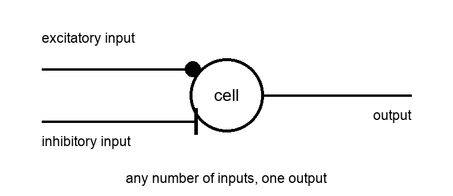
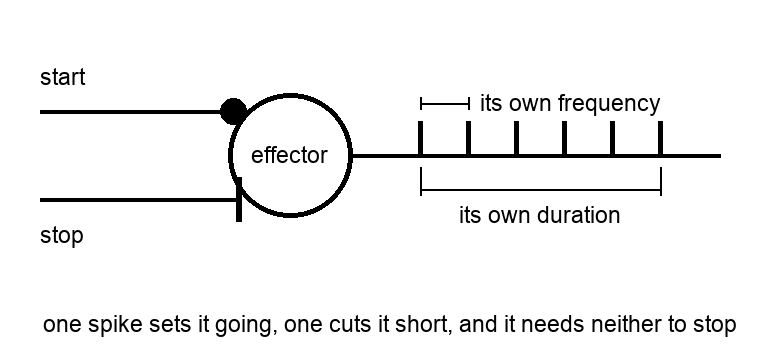
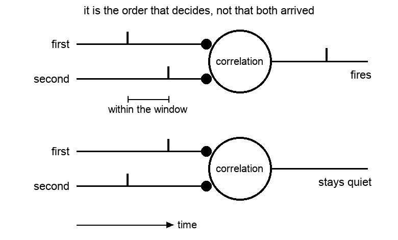
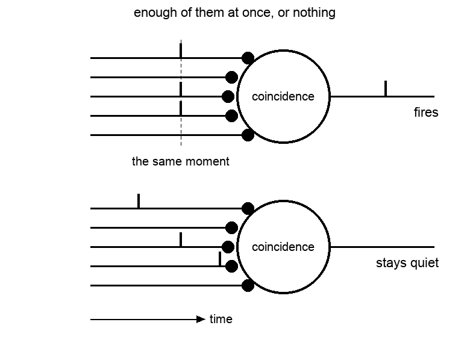

# 010 — Cells

- **Status:** draft
- **Date:** 2026-08-28
- **Supersedes / Superseded by:** —

The three layers of [spec 002](002-vehicles.md) are made of cells. This is what a cell is, what any of them have in common, and what the ones built so far actually do.

## What a cell is
A cell can have any number of inputs and exactly one output, and each input is connected either excitatorily or inhibitorily.

An excitatory connection is drawn as a filled circle against the cell and an inhibitory one as a bar.

What travels on any of those lines is a spike, and only a spike, a signal that has happened rather than a value that can be read. 

A cell that has just fired is deaf to itself for a **refractory period** — 2 ms in [spec 004](004-simulator.md) — so 500 Hz is the most any of them can do. As in biology, it is that and not the width of the spike, about a millisecond, that sets the ceiling.

Which is far above anything used: the fastest effector of [spec 003](003-neuromorphic-actuators.md) runs at 100 Hz.

The input connections have a 'weight' value, to indicate if the connection is mature or not. If the connection is not mature the spike will not go to the cell. Weight values is in the (0, 1) interval with values above 0.7 are considered mature.

## Type of Cells
### Effector Cell
It is a cell commonly used to control actuators, as [spec 003](003-neuromorphic-actuators.md) describes.

It main function is to emit a train of spikes at a fixed frequency and time. If the cell has mature input connections it will start the emit process when an excitatory spike arrives, and finish when an inhibitory one arrives or the process run out of its time. If the cell has not mature connections it can start the emit process spontanouely at random. 

### Correlation Cell
This cell has two input connections and fires if the second connection arrives *after* the first one.

Both inputs arrive in either case. What settles it is the order, which is what makes a pair of these — one wired each way round — able to tell a movement from the same movement backwards.

The time window has a minimum and maximum value, so to discard spikes arriving at almost the same time or too far away. Ex: (10, 50) (in ms).

#### The window is what the cell measures
A pair of these tells one direction from the other, and that is all it tells while every cell of the layer carries the same window. What settles a direction is *which* input came first; what a window settles is *how long* the one waited for the other. Give different cells different windows and the layer stops reporting only where something went and starts reporting **how fast it got there**.

Which is worth spelling out, because it is not where one would look for it. Speed is not in how far a thing jumps between one report and the next: an eye reports far too often for anything to skip past a cell unseen. In [Vehicle 1](005-vehicle-1.md) that would need nine thousand degrees a second, against the eighty its fastest effector can turn the head. Everything always moves from one cell to the one beside it, at every speed there is.

Speed is in the interval instead — how long a thing takes to cross a cell, which for Vehicle 1 runs from about 112 ms when the head sweeps at its fastest to over two seconds when it barely creeps, a range of some twenty to one:

| what moves the head | its speed | to cross one cell |
|---------------------|-----------|-------------------|
| the fastest effector | 80 °/s | 112 ms |
| the slowest of the ladder | 8 °/s | 1125 ms |
| the gentlest, made for going along with something | 4 °/s | 2250 ms |

So a cell whose window is centred on 112 ms fires for a head sweeping at full speed and stays quiet for one that creeps, and a cell centred on a second does the opposite. A row of them, each with its own window, is a row of speeds.

#### What it has to be wired to
Not to the pair of eye cells a move goes between. Those two report the same instant — one goes empty exactly as the next goes busy — so the interval between them is zero, and whatever separates them is a delay somebody put there rather than anything about the movement. It reads the same at four degrees a second as at eighty.

The interval that carries speed is the one from **one crossing to the next**, so the cell has to be wired to eye cells with a gap between them: a cell watching the third and the fifth measures how long the fourth took to cross. Cells two apart measure one cell's worth of transit, three apart two cells' worth, and so on.

The bands are cut at the geometric mean between one transit time and the next, so they tile without overlapping and each holds exactly one of the speeds the body can move at. Run against the eye, what fires says how fast the head went: at every one of the five, the median of the speeds the firing cells stand for is the speed the head was actually going, and the spread is one band either side.

Reading a speed and having a use for one are different things: fed to the vehicle that learns its own wiring, these cells make it worse rather than better, for reasons written up in [spec 005](005-vehicle-1.md).

Which puts the layer's cells that never fire to work. Of the 72 pairs in [Version C](005-vehicle-1.md) only the 16 adjacent ones can ever occur, and the other 56 looked like a fully connected layer being wasteful. They are not: they are where speed is, and they were idle only because every cell was given the same window, and a window too short for any transit — the 10 to 50 ms that orders two simultaneous events is nowhere near the 112 ms to 2 s a movement takes.

### Coincidence Cell
This cell have many inputs connections and fires if the mayority of the inputs arrives at the same time.

The same spikes arrive in both cases and the same number of them. Only their falling together makes any difference.

## The cells there are so far
Three kinds, with less in common than one might expect.

| | inputs | what it does |
|---|--------|--------------|
| **Effector** ([spec 003](003-neuromorphic-actuators.md)) | start, stop | emits at its own frequency for its own duration, and drives an actuator. Unwired, it fires by itself — the babbling of spec 002 |
| **Relay** ([Version B](005-vehicle-1.md)) | one | fires when its input fires. The plainest cell there could be |
| **Correlation** ([Version C](005-vehicle-1.md)) | predecessor, successor | fires only if the predecessor arrived first, and within a window. The pair `(i→j)` and the pair `(j→i)` are different cells, which is what makes it tell one direction from the other |

## What they have not got
No membrane, no threshold, nothing accumulating. Not one of the cells built so far integrates anything: each is a small rule over the spikes at its inputs, and it either fires or does not.

That is a deliberate simplification and it may well not last. It holds while a cell has one or two inputs and reacts to a pattern between them. The moment a cell has to weigh many inputs against one another — which is what a cortex is for — something like a membrane filling up to a threshold is the usual answer, and none of this has one.

## Connections
A connection carries a spike from one cell's output to another's input.

Through Versions A to C a connection is simply there or not there. In [Version D](005-vehicle-1.md) it is a **weight**, and what a cell does is settled by which of its connections is the strongest. That change is what lets *not connected* soften into *connected weakly*, so that babbling fades as a vehicle learns rather than stopping the moment somebody wires it.

Inhibition sits awkwardly. The effector layer is supposed to inhibit its own cells laterally, so that only the last one woken stays active, but whether that is wiring between the cells or a property of the layer above them is not decided. The simulator does it above them, which is a choice made for convenience and not from the design.

## Open questions

- Is there one cell here, or three unrelated rules that happen to speak in spikes? A common model would make a new kind cheap to add, and would say what a cell of this project can and cannot compute.
- Does a cell need a membrane and a threshold? Nothing so far has wanted one, but nothing so far weighs more than two inputs.
- Do cells have a refractory period, as the sensors of spec 001 do? Nothing stops one firing on consecutive cycles today.
- Lateral inhibition: wiring between cells, or something the layer does to them?
- Windows for speed are the size of the movements they measure, hundreds of milliseconds, while windows for order are tens. One kind of cell with a window that spans either, or two kinds?
- A cell wired to eye cells three apart fires for the same speed as one wired two apart with a window half again as long. What tells them apart is what happens in between, which the cell never sees.
