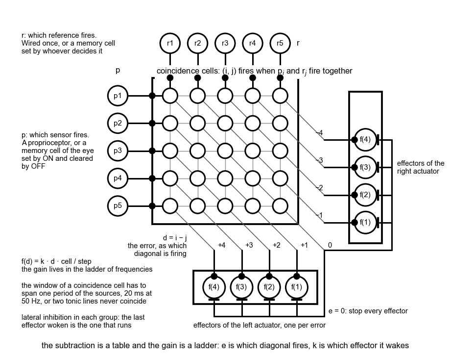

# 011 — A neuromorphic P controller

- **Status:** draft
- **Date:** 2026-09-02
- **Supersedes / Superseded by:** —

## Context
A traditional Proportional Controller is defined by this formulas:

```
e = p − r
o = k × e
```

Where `p` is a perceived value, `r` the reference value, `k` a gain and `o` the output. The purpose of the controller is to modify `o` in order to `p` matches `r`.

The question is how can this kind of controller be implemented with the spiking cells used in this project.

## Goal
A circuit of the existing cells of [spec 010](010-cells.md) (coincidence, memory, effector) that behaves as `o = k × (p − r)`, with `p` and `r` both arriving as spikes, and nothing added, subtracted or multiplied anywhere but in the wiring.

## Design

General idea: 
- encode `r` as a set of memory cells (where only one is ON) representing the goal (in [Vehicle 1](005-vehicle-1.md) es cell 5 of the eye), set by whatever decides the reference
- encode `p` as a set of memory cells (where only one is ON) representing where is the object perceived in the eye, each one set by a cell of the eye going busy and cleared by it going empty
- a matrix of coincidence cells relating `r` with `p`, so its representing `e`
- a connection with this cells to the effectors in order to produce `o`



Notes:
- `r` comes from upper levels, the cortex of [spec 002](002-vehicles.md) (can be fixed (allways the same value, or change over time)
- the frequency of `r` defines the controller time interval
- in case learning is required, this happens in changing the relationship of the matrix with the effectors
  

### What each symbol becomes
There are no values on any wire, so each term of the controller has to be *which* cell is firing. 

| symbol | in [Version A](005-vehicle-1.md) | here |
|--------|--------------|------|
| `p` | a number, which cell | one line per level, and the one that fires is the reading. A proprioceptor of [spec 001](001-neuromorphic-sensors.md) does this by itself, tonically at 50 Hz. The eye only reports change, so it needs a **memory cell** per cell of the eye, set by that cell's ON and cleared by its OFF, to hold *the object is in cell i* as a line that fires while it is true|
| `r` | a constant | the same, one line per level, and a memory cell each: set by whatever decides the reference, it emits at its own frequency for as long as it is the reference, and that frequency is the interval the controller runs at. A reference that never changes is one set once and never cleared. It is the effector cell of [spec 003](003-neuromorphic-actuators.md) with no duration, which is what a memory cell is |
| `e` | a subtraction | which cell of a layer fires. Its sign is which side of a diagonal the cell sits on, its size is how far from the diagonal |
| `o` | a rate of turn | which effector is emitting. The sign picks the actuator of the antagonist pair, the size picks the effector's frequency. **`k` lives in the ladder of frequencies** and in no cell at all |

### Explanation

Five levels are drawn; the real layers have nine or ten. Four parts.

**The subtraction is a table.** One coincidence cell per pair `(i, j)`, excited by `p_i` and by `r_j`, so it fires when both do. Every cell with the same `i − j` means the same error, and those cells form a diagonal of the table. The diagonal is what gets wired, not the cell. This is the trick the 72 correlation cells of [Version C](005-vehicle-1.md) use: the whole table built, the meaning put in the wiring, and nothing computed at run time.

**The gain is a ladder.** Each diagonal `d > 0` reaches the `start` of the effector of the right actuator whose frequency is `f(d)`, and each `d < 0` the effector `f(|d|)` of the left — the cells of the eye being numbered from the left, an object at a higher cell than the reference sits to its right. Under lateral inhibition in the effector layer — the last cell woken is the one that runs, as [spec 005](005-vehicle-1.md) assumes throughout — a change of diagonal is a change of effector.

**Zero error is a stop.** The diagonal `d = 0` reaches, inhibitorily, the `stop` of every effector. In [Version B](005-vehicle-1.md) the middle cell reaches nothing; here it reaches the brake, which is what a proportional controller does when the error goes to nothing and is not the same as doing nothing.

**The output holds while the error does.** A coincidence cell keeps firing as long as `p_i` and `r_j` keep firing, and every spike of it re-starts the effector. An effector that is already emitting ignores a `start`, so it runs out its duration and the next spike starts it again. Which is [Version A](005-vehicle-1.md)'s *the controller runs every tick*, at the 50 Hz of the sources rather than the 1 kHz of the simulator; the gap between one run ending and the next spike starting it is at most one period of the sources.

### Two tonic lines never coincide
A thing the coincidence cell of [spec 010](010-cells.md) does not yet say. `p_i` and `r_j` both fire at 50 Hz, and nothing lines them up, so the two spikes of a pair land up to 20 ms apart and *at the same time* has to mean *within one period*. With no window the table never fires. So the coincidence cell takes a **window**, one period of its sources at least — or a cell `(i, j)` is made of the pair of correlation cells `(i→j)` and `(j→i)` with the window `(0, 20)` ms, both wired to the same `start`. The first is one cell and the second is two, and they are otherwise the same thing.

### The numbers of `k`
An effector at `f` Hz turns the head `f × degrees per spike` degrees a second, so the frequency that reproduces `o = k × e` for an error of `d` cells is

```
f(d) = k × d × cell width / degrees per spike
```

With the `Kp = 2` of [spec 005](005-vehicle-1.md), cells of 9 degrees and 0.8 degrees a spike:

| `d` | `e` | `o = k × e` | `f(d)` exact | `f(d)` built | the ladder of [spec 003](003-neuromorphic-actuators.md) | `k` it amounts to |
|-----|-----|-------------|--------------|--------------|------------------------|-------------------|
| 1 | 9° | 18 °/s | 22.5 Hz | 22.7 Hz, every 44 ms | 10 Hz | 0.9 /s |
| 2 | 18° | 36 °/s | 45 Hz | 45.5 Hz, every 22 ms | 20 Hz | 0.9 /s |
| 3 | 27° | 54 °/s | 67.5 Hz | 66.7 Hz, every 15 ms | 50 Hz | 1.5 /s |
| 4 | 36° | 72 °/s | 90 Hz | 90.9 Hz, every 11 ms | 100 Hz | 2.2 /s |

Two things fall out of that table. The ladder [spec 003](003-neuromorphic-actuators.md) already has makes [Version B](005-vehicle-1.md) a proportional controller whose gain **grows with the error**, from under one to over two, rather than a constant one. And the exact ladder cannot be built: [spec 004](004-simulator.md) asks every period to be a whole number of ticks, so each rung is rounded to the nearest millisecond of period, and a constant `k` on this simulator is a `k` that is constant to within that rounding. Past four cells the rung would run faster than the 100 Hz [Version A](005-vehicle-1.md) is capped at, so it is that effector again: with the reference moved off the middle the error can reach eight cells, and the last four rungs are the same.

### What it costs
`N × M` coincidence cells for `N` levels of `p` and `M` of `r` — 81 for the eye against itself, 100 for a proprioceptor against one — and `2N − 1` diagonals, of which the middle one stops and the rest each wake a rung of the ladder on their side. No new kind of cell. The window of the coincidence cell is the only thing [spec 010](010-cells.md) has to grow.

### Dead zone, for nothing
Wire the diagonals `|d| ≤ 1` to nothing and the controller has a dead zone, at no cost beyond the wiring. That is precisely the law the neck of [Vehicle 2](006-vehicle-2.md) runs, `neck rate = Kr × how far the eye is outside its comfortable range`, in spikes: `p` is the proprioceptor of the head joint, `r` is wired to its middle level, the diagonals inside `HEAD_COMFORT_DEG` reach nothing, and the rest reach the neck's effectors. And it leaves the chatter of [Version A](005-vehicle-1.md) where it is, since the diagonals next to zero are exactly where the head trembles.

### What it does not reproduce
- **Everything is quantised.** `e` to whole cells and `o` to the rungs of the ladder. [Version A](005-vehicle-1.md) already has `e` in whole cells — the chatter at a cell boundary is its consequence — so the ladder is the only quantisation that is new.
- **Nothing integrates.** An error carried as a firing rate rather than as which cell fires would need a membrane to sum it, and [spec 010](010-cells.md) has none. Nor would it help: an effector's frequency is fixed, so picking an effector is the only way there is of setting a rate. The place code is not a compromise. It is what the effector layer already speaks.

## Acceptance criteria
Built as [Version F](005-vehicle-1.md) of [Vehicle 1](005-vehicle-1.md), which is where the numbers are.


- [x] On the body of [spec 005](005-vehicle-1.md) with `r` wired to the middle level: an object standing in cell `i` wakes the effector `f(|i − 5|)` of the actuator on the object's side, and no other, and the head turns toward it.
- [x] With the object in the middle cell every effector stops, and none starts again while it stays there.
- [x] Moving `r` from level 5 to level 3 with the object still in cell 5 makes the head turn as if the object were two cells off the middle, the eye having reported nothing.
- [x] Two tonic sources at the same rate and any phase make their coincidence cell fire at that rate; the same two with one silent make it fire never.
- [x] Over the experiment of [spec 005](005-vehicle-1.md) the circuit with the exact ladder of the table above matches [Version A](005-vehicle-1.md)'s head angle to within one cell of the eye at every moment.
- [x] Nothing in the circuit reads a value. Every cell's inputs are spikes, and the only state anywhere is in memory cells and in what an effector has left to emit.

## Open questions

- The coincidence cell of [spec 010](010-cells.md) needs a window, and this is the first thing to say how wide: a period of its sources. Does it belong to the cell, as the correlation cell's does, or is a coincidence cell just a correlation cell that does not care about order?
- [Spec 003](003-neuromorphic-actuators.md) leaves open what an effector does with a second `start` while emitting. The circuit leans on it being ignored, as the simulator has it. If it restarted the duration instead, the output would hold exactly for as long as the error and the gap would vanish.
- `r` as a row of memory cells is the first thing in a vehicle that could be set by the cortex, which so far only judges. Whether a reference is something a cortex decides or something wired into the body is not settled, and this circuit works either way.
- The ladder of [spec 003](003-neuromorphic-actuators.md) was picked for [Version B](005-vehicle-1.md) and never argued for. The table above says what it should be for a given `k`, to within a millisecond, and whether it is worth changing the four rungs for a constant gain is a question for the experiment. [Version G](005-vehicle-1.md) of Vehicle 1 has since asked the vehicle itself, and its answer is that on this body the rung for every error is the fastest one: the gain worth having is the cap.
- Hysteresis, which [spec 005](005-vehicle-1.md) wants for the chatter and this circuit could give by having `d = 0` reach `stop` through a memory cell rather than directly, is not designed.
