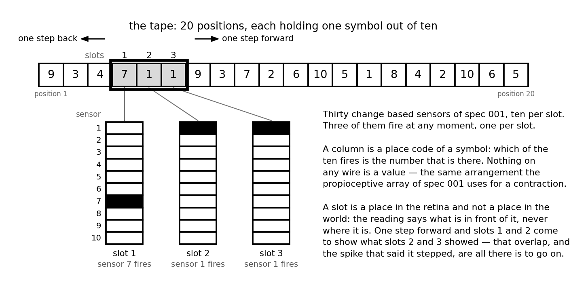

# 013 — A neuromorphic memory

- **Status:** draft
- **Date:** 2026-09-22
- **Supersedes / Superseded by:** —

## Context
Everything built so far answers the instant it is in. The eye of [spec 001](001-neuromorphic-sensors.md) reports what changed, the correlation cells of [spec 010](010-cells.md) report what changed a moment ago, the controller of [spec 011](011-neuromorphic-p-controller.md) compares what is there now against what should be, and the primitive of [spec 012](012-joint-primitive.md) does the same thing once per actuator. The only cell that outlives the moment is the memory cell, and what it holds is one fact — *the object is in cell 5* — until something undoes it.

That is enough to keep a state and nowhere near enough to keep a **place**. A vehicle whose sensors cover a slice of the world has no way, today, of being the same vehicle in the same world twice: leave a thing behind and it is gone, come back to it and it is new.

What this spec asks is whether the cells there are can hold a *space* — what is where in it, and the order one gets from one part of it to another — when nothing may be stored as a number and no cell may read one.

### The retina has no idea where it is
This is the whole of the difficulty and it is worth stating before any of the design, because everything below is a consequence of it.

Every sensor of the retina reports **in the retina's own terms**. A sensor firing means *the slot in front of me shows a 7*, and the slot it names is a place in the retina, not a place in the world. Slot 1 is slot 1 wherever the body has got to. That is what **egocentric** means: the frame of reference the reading comes in is the body's, and it travels with the body.

And there is no other frame available anywhere. The tape carries numbers, not addresses — no position is marked, nothing says *this is the fourth*, and no sensor could read such a mark if it were there. So an **allocentric** description — one where a place stays the same place while the body moves around, which is what a map is — does not exist in the world to be picked up. It is not sensed. It has to be manufactured, and out of the only materials there are.

Those materials are two:

- **a run of egocentric views**, each a perfectly good account of what is in front of the retina and a useless account of where the retina is;
- **the movement between one view and the next**, which the body reports — a spike saying it stepped, and which way.

So the problem this spec is about, stated plainly:

> **Build one allocentric map — the whole tape — out of many egocentric views taken from positions that are themselves unknown, given only the movements that separate them.**

Nothing but the movement relates one view to another. Add them up and the views fall into a single frame; fail to add one up and every view after it lands in the wrong place, with nothing anywhere to say so.

It is worth being exact about what *allocentric* can mean here, because the circuit delivers something slightly weaker than the word usually promises. The map that comes out does not move when the retina moves, which is the property that matters and the one an egocentric reading has not got. But its origin is wherever the body happened to be when it started counting, and no cell has any way of knowing what the world would call that place. It is a frame of its own making, consistent with itself and anchored to nothing — which is exactly what path integration gives an animal, and exactly why an animal also keeps landmarks. Both halves of that turn up below, in the odometer and in `h_i`.

## Goal
A circuit of the cells of [spec 010](010-cells.md) that turns a run of egocentric readings, and the known movements between them, into one allocentric map: which symbol stands at which place, which place comes after which, and which places it has not been to yet — and that can give the map back, in the same code the sensors speak, without the body moving at all.

## Scope
**In:** the simplest space that needs any of this — a line of positions, each holding one symbol, with a window that slides along it one position at a time. Where the allocentric frame comes from when nothing senses one. What has to be remembered, what part of it has to be built in advance, what it costs in cells, and how it is read back.

**Out:** anything that decides *where* to move, which is noted at the end and not designed. Spaces that are not a line. Forgetting. Any new kind of cell.

### The body: a tape and a window
The world is a tape of `P` positions, all in a row. Each position holds one symbol out of `V = 10`. The tape does not move and does not change while it is being read.

The retina is a window `W = 3` positions wide, with `V` change-based sensors per slot: **30 sensors**, and a sensor fires ON when its slot comes to show its symbol and OFF when it stops. Three of the thirty are true at any moment — one per slot — so each slot is a place code of a symbol, exactly the way the propioceptive array of [spec 001](001-neuromorphic-sensors.md) is a place code of a contraction.

The body does one thing: a step of one position, forward or back, and a spike on the line that says it did.



The window is on positions 4, 5 and 6, which hold 7, 1 and 1, so the sensors firing are `(1, 7)`, `(2, 1)` and `(3, 1)`. Two slots showing the same symbol is ordinary and says nothing: what a slot reports is *which* of its ten fires, and two of them may perfectly well be the same one.

`P = 20` is the default, and it is deliberately larger than `V`: a tape shorter than the alphabet can have every position distinct, which is the one case where all of this is easy and none of it is interesting.

## Design

```
  sensors (spec 001)              the body
   30, change based                one step forward or back
          │                                │
          ▼                                ▼
  ┌────────────────┐              ┌────────────────┐
  │  the reading   │  s(w,v)      │  the odometer  │  x_i
  │  30 memory     │              │  P memory      │
  │  3 firing      │              │  1 firing      │
  └───────┬────────┘              └───────┬────────┘
          │                               │
          └───────────────┬───────────────┘
                          ▼
                ┌────────────────────┐
                │      the map       │   m(i,v)
                │   P × V memory     │   one per column, or none at all
                └───┬────────────┬───┘
                    │            │
          readout ◄─┘            └─► agree ─►  h_i, where I am
              │                                     │
              ▼                                     └─► sets the odometer
     r_v, the recalled symbol, in the
     same code the sensors speak
```

Four rows and three tables between them. None of them is a new kind of cell.

### Remembering is latching a cell that was already there
The whole design turns on one move, and it is the move [spec 011](011-neuromorphic-p-controller.md) already made: *the table is built, the meaning is in the wiring, nothing is computed at run time*. Applied to memory it says something stronger than it did there.

There is no place to put a value, so **a memory is not something written anywhere — it is a cell that was already built having been set and not cleared**. A coincidence cell recognises; the memory cell behind it holds. Experience does not create anything; it selects which of the capacity already there is on.

That is a real claim with a real bill attached, and the bill is paid in the section on cost.

### The reading: an adapter, as spec 012 said
Thirty sensors report change; every table downstream wants a line that fires while something is *true*. So between them sits the row of memory cells of [Version F](005-vehicle-1.md) — one per (slot, symbol), set by that sensor's ON and cleared by its OFF, firing tonically at `HOLD_RATE_HZ` while it holds.

Thirty cells, three of them firing. [Spec 012](012-joint-primitive.md) already ruled that this row is an adapter in front of the circuit and not part of it: a propioceptor would need none.

### The odometer: where the window is, built out of having moved
Position is the one thing the network is not given, as the Context says at length. There are no coordinates anywhere — there is what it sees, and the fact that it moved. So the allocentric frame has to be *made* out of moves, and the shape it has to end up in is the shape everything else in this project speaks: `P` lines, of which one fires. **The odometer is the frame of reference itself**, and it is a row of cells like any other row.

A row of `P` memory cells, exactly one held. Stepping it is the spec 011 table again, cut down to two diagonals:

- one coincidence cell `F_i` per position, excited by the odometer line `x_i` and by the **forward** line. It sets `x_{i+1}` and clears `x_i`.
- one coincidence cell `B_i`, the same with the **back** line, setting `x_{i-1}`.

`2P` coincidence cells and `P` memory cells. The odometer line is tonic at 50 Hz and the move spike is a single event, so *together* means within one period of the tonic source — the same 20 ms window spec 011 needed, for the same reason.

**One move has to be one step, and a delay cell is what makes it one.** Set `x_{i+1}` the instant `F_i` fires and the new line starts emitting while the move spike is still inside its own window; `F_{i+1}` then sees both and steps again, and one move runs away down the row. The fix is the delay cell of [spec 010](010-cells.md) on the wire from `F_i` to the set of `x_{i+1}`: by the time the new line speaks, the move spike is stale and can pair with nothing.

The same delay settles a second thing that would otherwise be wrong, which is the sort of coincidence worth stopping at. The odometer steps when the body moves; the reading changes when the sensors settle, `SETTLE_MS` later. In between there is a window in which the *new* line meets the *old* reading, and the map gets the previous position's symbol written into the next position's column. Holding the odometer back past the settling closes it. So one number does both jobs, and it is bounded on both sides:

```
move duration + SETTLE_MS  ≤  STEP_DELAY_MS  <  the shortest interval between two moves
```

**Considered and rejected: stepping the odometer from the reading instead of from the move.** It needs no efference copy and no delay, and it is wrong twice over — it cannot tell a move from the world changing under a window that stayed put, and it does nothing at all on a step onto a position whose window happens to read the same. A step is a fact about the body, and it has to come from the body.

Which leaves *which* part of the body. The motor command is available immediately and is a claim rather than a fact — a step that was commanded and did not happen leaves the odometer a line ahead of the window, with nothing anywhere to say so. A propioceptor is the truth and arrives afterwards. Where the joint has one, as every joint in this project does, **the propioceptive array already is the odometer** and none of this row need be built: it is `P` lines with one firing, which is what the row is. The odometer is what one builds when the space is larger than the joint's travel, or when the thing that moves is a wheel — [Vehicle 3](007-vehicle-3.md) — and there is no absolute sensor anywhere. Everything downstream is wired to the row and cannot tell which kind it got.

### The map: a column per position, a cell per symbol
`P × V` memory cells. `m(i, v)` firing means *position `i` holds symbol `v`*.

Writing it is one more table. The window's centre is at `x_i`, so slot 2 is looking at position `i`, slot 1 at `i − 1` and slot 3 at `i + 1` — and an offset between a slot and a position is an **offset in the wiring**, free, the way the diagonals of [spec 011](011-neuromorphic-p-controller.md) are free. Three coincidence cells set `m(i, v)`:

| excited by | and by | because |
|---|---|---|
| `x_i` | `s(2, v)` | the centre slot is on `i` |
| `x_{i+1}` | `s(1, v)` | the trailing slot is one behind the centre |
| `x_{i-1}` | `s(3, v)` | the leading slot is one ahead of it |

**That table is the change of frame, and it is wiring and not arithmetic.** `s(2, v)` says *a `v` is in front of me* and `m(i, v)` says *a `v` is at `i`*, and what stands between the two is one coincidence cell that fires when the egocentric line and the odometer's line fire together. The transformation costs no cell that computes anything: it is the trick of [spec 011](011-neuromorphic-p-controller.md) again, a table built in advance with its meaning in the wiring. The readout below runs the same conversion the other way, from the map's frame back into the retina's.

That a change of reference frame should come out as the conjunction of two place codes is not an invention of this spec. It is what gain fields in the parietal cortex are generally taken to be doing — a retinal position multiplied by an eye or head position — and a coincidence cell between two tonic lines is the poor man's version of that product.

**A column holds one symbol or none.** Setting `m(i, v)` clears every `m(i, u)` with `u ≠ v` — the lateral clear that keeps the `p` row of spec 011 one-hot, here inside a column. Two things fall out of it, and the second is the one that matters:

- a position whose symbol changed is corrected on the next visit, and only its column changes;
- **a column with nothing firing is a position never seen, and that is not the same as a position holding zero.** A place code gets *I do not know* for nothing. A number would have had to reserve a value for it and would have had to be told the difference.

### Reading it back: the memory speaks the sensors' language
A map nothing can read is a map nobody has. The readout is `P × V` coincidence cells, `m(i, v)` against `x_i`, and every one of them for the same `v` converges on one line `r_v`.

So the recalled row is `V` lines with one firing — **the same shape, the same code and the same rate as one slot of the retina**. Anything wired to look at the world can be wired to look at the memory instead, and needs no adapting to do it. That is what makes the map a stand-in for the tape rather than a record about it.

And then the sequence the whole exercise was for:

**Replay is the same circuit with the move line driven from inside.** Hold the body still, spike the forward line from a memory cell of its own, and the odometer walks the row while `r_v` produces symbol after symbol in the order the tape has them. Spike the back line and the same walk comes out backwards. The order was never stored anywhere: *the sequence is the odometer's own wiring, and remembering it is walking it.* There is no second memory for it and nothing to keep consistent with the first.

The same machinery run one step ahead of the body is **prediction** — drive a second odometer to `i + 1` while the window is still at `i`, and `r_v` says what the leading slot is about to report. A coincidence between that and `s(3, v)` is confirmation; its absence is surprise, which is the first thing in this project that could be worth learning from. No new cells, and it is left at that here.

### Knowing where you are, when the count is wrong
Nothing corrects an odometer. One step missed or one counted twice and every column after it is written in the wrong place, and no cell anywhere is in a position to notice.

What can notice is the map disagreeing with the window. Per column, three coincidence cells between the stored symbol and the slot that ought to be showing it — `m(i, v)` against `s(2, v)`, `m(i−1, v)` against `s(1, v)`, `m(i+1, v)` against `s(3, v)` — feeding one coincidence cell that wants the **majority**, which is the rule [spec 010](010-cells.md) already gives for a cell with many inputs. Call its output `h_i`: *what I am looking at is what I remember around `i`*.

One `h_i` firing and no other is a position identified from its contents alone, with the odometer contributing nothing, and it can set the odometer to `i`. That is relocalisation, and it is also, plainly, recognising a place one has been.

**This is what the width of the window is for.** One slot would be enough to build a map; three are what make a place recognisable. A single symbol out of ten cannot distinguish twenty positions — the pigeonhole settles that before any tape is drawn. A window of `W` gives `V^W` possible contents, and on a tape drawn at random the expected number of colliding pairs is

```
C(P, 2) / V^W
```

| `W` | distinct windows | expected collisions on `P = 20` | a tape with no ambiguity at all |
|---|---|---|---|
| 1 | 10 | 190 / 10 = 19 | impossible |
| 2 | 100 | 1.9 | about one tape in seven |
| 3 | 1000 | 0.19 | about five tapes in six |

So `W = 3` is the narrowest window that usually makes a tape of twenty positions unambiguous, and the 30 sensors are three slots because of that and not for any other reason. The general rule is `W ≳ log_V(P² / 2)`, which is gentle: a space a hundred times bigger costs two more slots.

### Saying *not yet seen*
Exploration wants the one thing the circuit cannot say. `m(i, ·)` all silent is *not visited*, and silence excites nothing.

It costs a cell and no new kind of one. A memory cell `seen_i` per column, set by any write into it and never cleared; and `unseen_i`, a cell with one excitatory input from anything tonic and one inhibitory input from `seen_i`, under the rule [spec 012](012-joint-primitive.md) already asks for — *an inhibition arriving together with an excitation wins*. **A negation in this project costs a tonic source and an inhibitory wire**, and that is the only way there is of saying *not*.

With `unseen_i` there is a row of lines saying *there is something I do not know at `i`*, which is a reference row. Which makes the thing that would drive the exploring the controller of [spec 011](011-neuromorphic-p-controller.md), unchanged, with `p` the odometer and `r` wired to what is not yet known: **exploring is a P controller whose reference is ignorance**. Whether that is the right drive, and what happens when it runs out, is not this spec's business.

### What it costs
For `P = 20`, `V = 10`, `W = 3`:

| part | coincidence | memory | delay |
|---|---|---|---|
| the reading | — | `WV` = 30 | — |
| the odometer | `2P` = 40 | `P` = 20 | `2P` = 40 |
| the map, written from all three slots | `WPV` = 600 | `PV` = 200 | — |
| the readout | `PV` = 200 | — | — |
| where I am | `WPV + P` = 620 | — | — |
| not yet seen | `P` = 20 | `P` = 20 | — |
| **total** | **1480** | **270** | **40** |

Everything is `O(P × V)`: linear in the size of the space and linear in the alphabet. Against the 81 cells of [spec 011](011-neuromorphic-p-controller.md) it is a lot, and against what it buys it is very little — that is the first thing in this project whose cost grows with the world rather than with the body.

Two economies are available and both cost something real. Writing only from the centre slot drops 400 coincidence cells and loses seeing ahead, which is prediction. Dropping `h_i` drops 620 and loses relocalisation, which is the only defence the odometer has.

### The other design: no coordinate at all
There is a memory of this tape that needs no odometer, no origin and no `P`, and it is worth setting down because it fails in exactly the opposite way.

Remember **the windows themselves**. One coincidence cell per possible content `(a, b, c)`, latching one memory cell: the map is then the *set of triples the tape contains*, and the order between them needs no storing either, because consecutive windows overlap in two slots — after `(a, b, c)` comes some `(b, c, d)` and nothing else can. The sequence is in the wiring, fixed in advance and never learned, and reassembling the tape is walking that graph. It is the de Bruijn graph a genome assembler walks, arrived at from the other end.

| | the odometer and the map | the set of windows |
|---|---|---|
| cells | `O(P × V)`, 1790 here | `O(V^W)`, 2000 here and 10⁵ at `W = 5` |
| needs an origin | yes | no |
| can drift | yes, and nothing inside it notices | no, there is nothing to drift |
| random access | yes: *what is at `i`* | no, only *what follows this* |
| two stretches that read alike | told apart, they are different columns | not told apart, they are one cell |
| grows with | the space | the alphabet, exponentially in the window |

The coordinate version is cheap and can be lost; the content version cannot be lost and cannot tell a place from its double. **They fail in opposite directions, which is the reason to have both**, and `h_i` above is precisely the second one used to repair the first: path integration corrected by landmarks, which is the arrangement an animal is generally supposed to use and is written here because the cells fell that way, not the other way round.

## What the spec fixes

| number | value | note |
|---|---|---|
| `V` | 10 | symbols per position, and sensors per slot |
| `W` | 3 | slots, from the table above and not by taste |
| `P` | 20 | positions, provisional: it is how many columns get built |
| `HOLD_RATE_HZ` | 50 | as [spec 011](011-neuromorphic-p-controller.md), so the tables read either row |
| `COINCIDENCE_WINDOW_MS` | 20 | one period of the tonic rows, as spec 011 |
| `STEP_DELAY_MS` | provisional | bounded on both sides above; one number, two jobs |

## Acceptance criteria

- [ ] Swept once from one end of the tape to the other, the map read out column by column reproduces the tape exactly.
- [ ] Every column the window never covered is silent on readout; every column it did cover fires exactly one line.
- [ ] Sweeping back over the same tape sets no cell that was not already set and clears none that was.
- [ ] One move spike moves the odometer exactly one line, at every rate the body can step at, and the column written after a step is the one the window is actually on.
- [ ] With the body held still and the forward line driven from inside, `r_v` produces the same sequence of symbols, in the same order, as the sweep did — and the reverse sequence when the back line is driven instead.
- [ ] A symbol changed in the world while unobserved is corrected on the next visit, and no other column changes.
- [ ] On a tape whose windows are all distinct, with the odometer deliberately set one line wrong, exactly one `h_i` fires and it is the true one, within one window of the reading settling.
- [ ] `unseen_i` fires for every column never written and for no other.
- [ ] Nothing in the circuit reads a value. Every cell's inputs are spikes, and the only state anywhere is in memory cells and in what a delay cell has left to wait.

## Open questions

- **Where does the odometer start, and is it the same place next time?** This is the part of *allocentric* the circuit does not deliver: a map built from a different origin is a different map, the two are incompatible, and nothing in the circuit would notice. A ring — `x_P` stepping to `x_1` — would make the origin a matter of phase and make coming all the way round recognisable, and it would also make a tape longer than the row silently wrap onto itself.
- **`P` is built in advance, so the network can only remember a space as big as the row it was given, and what happens at the end of the row is undefined.** Growing the row is one answer and is not a thing cells do. Two rows of different pitch, whose pairing spans far more positions than either — which is roughly what grid cells are said to be for — is another, and is not designed.
- **Nothing here forgets.** The memory cell of [spec 010](010-cells.md) has no duration, by design, so every cell set stays set for ever and the only thing that undoes a column is seeing it again. A memory that decays is a different cell, or the effector cell of [spec 003](003-neuromorphic-actuators.md) read as one, which is where spec 010's open question about the two of them leads.
- **Relocalisation is one-shot.** `h_i` either fires alone or it does not; there is nothing that carries *how much* the count is trusted against *how much* the contents are, and blending the two is what a real estimator does.
- **The same lines carry a perceived reading and a replayed one**, since the point of `r_v` is that it is in the sensors' code. Nothing distinguishes them, and everything downstream of the retina would act on a replay as on a perception. The usual answer is a corollary discharge — a line that says *this one is mine* — and there is none.
- **Does the map belong to the cortex of [spec 002](002-vehicles.md)?** It is the first thing in the project that is neither sensory, nor effector, nor a reflex wired between them, and the first that is about the world rather than about the body.
- **Are the write table and the agree table the same table read two ways?** Both are `W × P × V` coincidence cells over the same three rows; one pairs the odometer with the reading, the other the map with the reading. Half the cells of this design are in those two, so the question is worth more than its elegance.
- **A line is not a space.** Two dimensions want two odometers, or one row over pairs; a space that branches wants a graph and has no odometer at all. Everything above except the odometer survives that — the map is indexed by a row, and where the row comes from it does not ask.
