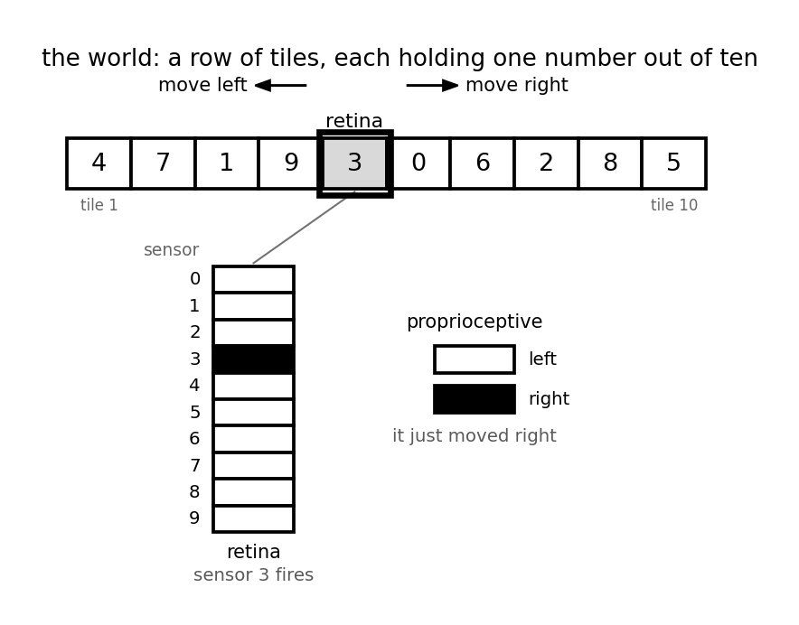
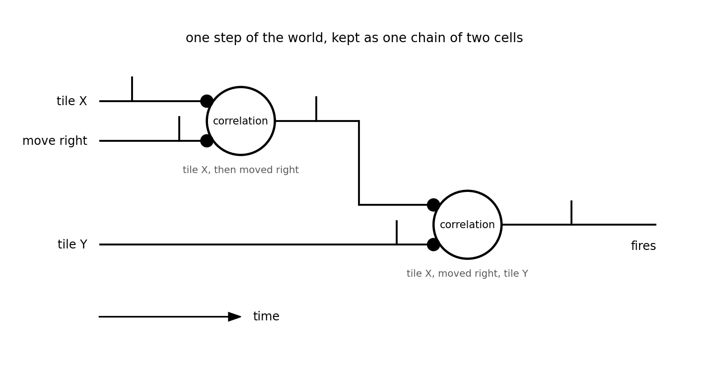

# 014 — A neuromorphic episodic memory

- **Status:** draft
- **Date:** 2026-09-24
- **Supersedes / Superseded by:** —

## Context
*Episodic* is Tulving's word for the memory of what happened: not a fact on its own, but a sequence lived from where the body was — *I saw this, I moved that way, then I saw that*. It is set against *semantic* memory, which keeps the fact and drops the episode it was learned in. Two things follow. The movement is part of what is stored, so every transition carries its cause. And recalling is replaying: given one point of a sequence, the memory gives back what came next.

That is what this spec builds, and how it differs from [spec 013](013-neuromorphic-memory.md): that one assembles a map of what is where; this one keeps the episodes, and leaves the map implicit in the chains of transitions.

## Goal
The goal is to have a memory who store info just from sensory info and later can be recalled just using SNN.

It has three levels:

1. Sensory. This is the sensors defined in [spec 001](001-neuromorphic-sensors.md).
2. Spatial. Receive spikes from sensors and stablish the concurrent patterns
3. Temporal. Groups the spatial layer spikes in sequences (what spatial pattern comes after another)

The recall function consist on ingesting an spatial pattern (not necessary to be perceived) and takes the next pattern the memory responds (can be more than one) as the answer.

### Level 1: Neuromorphic sensors
These are the sensors that feed the memory. Usually a combination of external sensors like the retina used in Vehicle 1 ([spec 005](005-vehicle-1.md)) and proprioceptive ones.

Notes:
- the proprioceptive sensor are needed to stablih the causal relations in the Temporal layer 

### Level 2: Spatial recognition (patterns)
Receive input from Level 1 and establish connections among the sensors that fires together.
- Use coincidence cells ([spec 010](010-cells.md))
- Neurons randomly connected to all sensors
- Hebbian pruning learning: synapses that coincide in time are strengthened; those that don't coincide disappear
- Example: one neuron recognizes that sensors 1 and 3 turn on together; another recognizes 2 and 3
- This is spatial recognition: everything fires at once, in the same place

### Level 3: Temporal sequence layer
Receive input from level 2 and establish connections among signal who come one after another.
- Use correlation cells ([spec 010](010-cells.md))
- Connects to the already-stabilized spatial recognition outputs (does not start dense).
- Each neuron learns the order: pattern A precedes pattern B within a time window.
- It also receives the direction sensors (left/right) to record the cause of each transition.
- Each edge of the graph has two labels: temporal order and cause of the movement.
- Note: since it also receives information about whether the retina itself moved, it eliminates all sequences that could be caused by the floor moving rather than the retina.

### Level 4: Recall (output)
To be defined. The idea is to have an alternative path to level 2 (instead of 'seeing' a pattern, 'imaging' one) and pick the next patterns in the sequence.

- Episodic memory: not only what happened, but why it happened.

## Example 1: simplest one
The simplest example is a world composed of tiles aligned horinzontally which each one have a number (0 to 9), a retina that can sense one tile per time and an actuator that can move the retina one tile to left or right.

The retina moves randomly left or right and the goal is the memory build a map of the tiles.

### Level 1: Sensors

- Retina. Ten sensors where only one fires at each time indicating which is the number in the tile
- Proprioceptive. Two sensor, to signal where the retina have moved (left or right)

### Level 2: spatial pattern
Not necessary in this case given just one sensor from the retina fires at a given time.

### Level 3: temporal sequence
Establish the causal relationship: seeing tile X, move right, seeing tile Y. This can be done with two correlation cells, the first one record the starting spatial pattern and the subsequent move ('tile X, move right') and the second one takes the output of the last one (predecessor connection) with the next pattern ('tile Y').

**Building the cells.** A practical way to grow this level is to make the cells as the episodes come. Keep the last three events — a reading, a move, a reading — and watch whether any cell of the level fired on them. If one did, the chain for that step already exists. If none did, add the two correlation cells for it: one on the reading and the move, one on that cell and the next reading.

This is not very neuromorphic — cells appearing on demand is a bookkeeping trick, not a rule of a network. A more biological version is not hard to picture: start with many cells wired at random, as level 2 does, and let the ones that never fire in order fall away.

## Example 2:
To be defined.
(AI: do not touch)

### Level 1: Sensors

- 3 motion sensors, each fires a pulse when it detects a change at its point.
- 2 additional sensors: one for leftward motion, one for rightward motion.

### Level 2: Spatial recognition (patterns)
Receive input from Level 1 and establish connections among the sensors that fires together.
- Use concurrent neurons
- Neurons randomly connected to all sensors
- Hebbian pruning learning: synapses that coincide in time are strengthened; those that don't coincide disappear
- Example: one neuron recognizes that sensors 1 and 3 turn on together; another recognizes 2 and 3
- This is spatial recognition: everything fires at once, in the same place

### Level 3: Temporal sequence layer
Receive input from level 2 and establish connections among signal who come one after another.
- Use predecessor neurons
- Connects to the already-stabilized spatial recognition outputs (does not start dense).
- Each neuron learns the order: pattern A precedes pattern B within a time window.
- It also receives the direction sensors (left/right) to record the cause of each transition.
- Each edge of the graph has two labels: temporal order and cause of the movement.
- Note: since it also receives information about whether the retina itself moved, it eliminates all sequences that could be caused by the floor 
